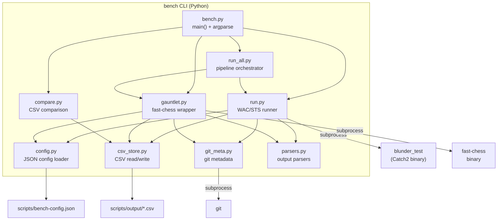

# Design Document: Benchmarking Infrastructure

## Overview

This design consolidates four ad-hoc Python scripts (`run-benchmarks.py`, `run-cutechess.py`, `run-tournament.py`, `analyze-sts.py`) into a single installable CLI tool called `bench`. The tool is a pure-Python package using only the standard library (argparse, subprocess, csv, json, pathlib, etc.) with zero runtime dependencies. It provides four subcommands — `run`, `gauntlet`, `compare`, `run-all` — backed by a JSON configuration file for cross-platform path resolution and an engine registry.

Key design decisions:
- **argparse over click** — zero external dependencies; the CLI is simple enough that argparse subparsers suffice.
- **fast-chess over cutechess-cli** — pure C++17, no Qt, builds with `make -j` on AL2 and MinGW.
- **Catch2 test binary** — WAC/STS benchmarks are run by invoking the existing `blunder_test` binary with Catch2 test name filters; the Python tool only parses stdout.
- **CSV result tracking** — append-only CSV files in `scripts/output/` with git metadata; backward-compatible with the existing `benchmarks.csv` column format.
- **Installable package** — `pyproject.toml` with `[project.scripts]` entry point so `pip install -e .` registers the `bench` command.

## Architecture



The package lives under `scripts/bench/` as a Python package:

```
scripts/
├── bench/
│   ├── __init__.py
│   ├── __main__.py      # python -m bench support
│   ├── cli.py           # argparse setup, main()
│   ├── config.py        # Config_File loader + platform resolution
│   ├── run.py           # bench run subcommand
│   ├── gauntlet.py      # bench gauntlet subcommand
│   ├── compare.py       # bench compare subcommand
│   ├── run_all.py       # bench run-all subcommand
│   ├── csv_store.py     # CSV append/read helpers
│   ├── git_meta.py      # git commit/branch/dirty detection
│   └── parsers.py       # Catch2 + fast-chess output parsers
├── bench-config.json
└── output/
    ├── benchmarks.csv
    └── benchmarks_categories.csv
pyproject.toml
requirements.txt
tox.ini
```

## Components and Interfaces

### cli.py — Entry Point and Argument Parsing

Responsibilities:
- Define the top-level `bench` argparse parser with global flags (`--config`, `--preset`, `--verbose`)
- Register subcommand parsers: `run`, `gauntlet`, `compare`, `run-all`
- Load config, then dispatch to the appropriate subcommand handler

```python
def main(argv: list[str] | None = None) -> int:
    """Entry point for the bench CLI. Returns exit code."""
```

Global flags:
- `--config PATH` — override config file location (default: `scripts/bench-config.json` relative to project root)
- `--preset NAME` — override build preset (affects binary path resolution)
- `--verbose` — enable debug-level output

### config.py — Configuration Loader

Responsibilities:
- Load and validate `bench-config.json`
- Detect platform (`os.name == "nt"` → windows, else → linux)
- Resolve platform-specific paths with variable interpolation (`${engine_binary}`, `${preset}`)
- Expand `~` and resolve relative paths against project root
- Append `.exe` on Windows

```python
@dataclass
class PlatformPaths:
    engine_binary: Path
    test_binary: Path
    fast_chess: Path
    opening_book: Path
    wac_epd: Path
    sts_epd: Path

@dataclass
class EngineEntry:
    name: str
    cmd: str          # may contain ${engine_binary} or absolute path
    protocol: str     # "uci" or "xboard"
    args: list[str]
    options: dict[str, str]

@dataclass
class Defaults:
    preset: str
    evaluator: str
    mode: str
    tc: str
    concurrency: int
    sprt_elo0: int
    sprt_elo1: int
    rounds: int
    book_depth: int
    baseline_engine: str
    candidate_engine: str

@dataclass
class Config:
    paths: PlatformPaths
    engines: dict[str, EngineEntry]
    defaults: Defaults
    project_root: Path

def load_config(config_path: Path, preset_override: str | None = None) -> Config:
    """Load, validate, and resolve the bench config file."""
```

Validation rules:
- Config file must exist (exit with error showing expected path)
- All resolved binary paths must exist (exit with error identifying the missing file)
- Engine registry names must be unique
- Referenced engine names in defaults must exist in the registry

### run.py — Benchmark Runner

Responsibilities:
- Execute WAC/STS benchmarks via the Catch2 test binary
- Map (suite, mode) → Catch2 test name
- Parse stdout for scores, ELO, NPS, per-category breakdowns
- Log results to CSV
- Detect regressions against previous runs

```python
def cmd_run(config: Config, args: argparse.Namespace) -> int:
    """Execute bench run subcommand. Returns exit code (0=success)."""
```

Catch2 test name mapping (matches existing convention):

| Suite | Mode   | Catch2 Test Name              |
|-------|--------|-------------------------------|
| WAC   | nodes  | `test_positions_WAC`          |
| WAC   | depth  | `test_positions_WAC_depth8`   |
| WAC   | time   | `test_positions_WAC_time1s`   |
| STS   | nodes  | `test_positions_STS-Rating`   |
| STS   | depth  | `test_positions_STS_depth8`   |
| STS   | time   | `test_positions_STS_time1s`   |

Invocation: `{test_binary} "{test_name}" --reporter compact`

Flags for `bench run`:
- `--suite {wac,sts,all}` (default: `all`)
- `--mode {nodes,depth,time,all}` (default: `all`)
- `--evaluator {hce,nnue,alphazero}` (default from config)

### gauntlet.py — Fast-Chess Wrapper

Responsibilities:
- Build fast-chess command line from config + CLI flags
- Resolve engine entries from the registry
- Stream fast-chess output to stdout while logging to file
- Parse results (W/L/D, Elo diff, SPRT conclusion)
- Save PGN and log to timestamped output directory

```python
def cmd_gauntlet(config: Config, args: argparse.Namespace) -> int:
    """Execute bench gauntlet subcommand. Returns exit code."""
```

Flags for `bench gauntlet`:
- `--type {sprt,roundrobin}` (default: `sprt`)
- `--baseline NAME` / `--candidate NAME` (engine registry names)
- `--engines NAME [NAME ...]` (for roundrobin)
- `--tc TC` (time control string, e.g., `10+0.1`)
- `--rounds N`
- `--concurrency N`
- `--book PATH` / `--book-depth N`
- `--elo0 N` / `--elo1 N` (SPRT bounds)
- `--fast-chess-args "..."` (passthrough)

### compare.py — Result Comparison

Responsibilities:
- Read CSV files and pivot data for comparison
- Display side-by-side tables with deltas
- Highlight STS categories differing by >5 percentage points

```python
def cmd_compare(config: Config, args: argparse.Namespace) -> int:
    """Execute bench compare subcommand. Returns exit code."""
```

Flags for `bench compare`:
- `--by {evaluator,commit,version}`
- `--commits HASH [HASH ...]` (when `--by commit`)

### run_all.py — Pipeline Orchestrator

Responsibilities:
- Run `bench run --suite all --mode all` then `bench gauntlet --type sprt`
- Collect results and failures
- Print consolidated summary

```python
def cmd_run_all(config: Config, args: argparse.Namespace) -> int:
    """Execute bench run-all subcommand. Returns exit code."""
```

### csv_store.py — CSV Read/Write

Responsibilities:
- Append rows to `benchmarks.csv` and `benchmarks_categories.csv`
- Create files with headers if they don't exist
- Read and filter rows for comparison and regression detection

```python
def append_main_result(output_dir: Path, row: dict) -> None:
def append_category_results(output_dir: Path, rows: list[dict]) -> None:
def read_main_results(output_dir: Path) -> list[dict]:
def get_previous_result(output_dir: Path, suite: str, mode: str, evaluator: str) -> dict | None:
```

CSV column format (backward-compatible with existing `benchmarks.csv`):
```
timestamp,commit,branch,evaluator,mode,suite,score_pct,score,max_score,elo,nps,nodes,time_secs,passed
```

### git_meta.py — Git Metadata

```python
@dataclass
class GitInfo:
    commit: str    # 7-char short hash, with "-dirty" suffix if uncommitted changes
    branch: str    # branch name or "HEAD" if detached

def get_git_info(project_root: Path) -> GitInfo:
    """Collect git commit hash and branch. Returns 'unknown' if not a git repo."""
```

### parsers.py — Output Parsers

```python
@dataclass
class BenchmarkResult:
    score_pct: float
    score: int
    max_score: int
    elo: int
    nps: int
    nodes: int
    time_secs: float
    categories: dict[str, CategoryResult]  # STS only

@dataclass
class CategoryResult:
    score: int
    max_score: int
    positions: int

@dataclass
class GauntletResult:
    wins: int
    losses: int
    draws: int
    elo_diff: float
    elo_error: float
    sprt_conclusion: str | None  # "H0", "H1", or None (inconclusive)

def parse_benchmark_output(stdout: str) -> BenchmarkResult:
    """Parse Catch2 test binary stdout for score, ELO, NPS, categories."""

def parse_fastchess_output(stdout: str) -> GauntletResult:
    """Parse fast-chess stdout for W/L/D, Elo diff, SPRT result."""
```

Regex patterns for Catch2 output parsing:
- `Score=(\d+\.\d+)% \((\d+)/(\d+)\)` — score line
- `ELO=(\d+)` — ELO estimate
- `NPS=(\d+)` — nodes per second
- `Nodes=(\d+) Time=(\d+\.\d+)s` — totals
- `\s+(.+?):\s+(\d+\.\d+)% \((\d+)/(\d+), (\d+) pos\)` — per-category

## Data Models

### bench-config.json Schema

```json
{
  "platforms": {
    "linux": {
      "engine_binary": "build/${preset}/blunder",
      "test_binary": "build/${preset}/blunder_test",
      "fast_chess": "~/fast-chess/fast-chess",
      "opening_book": "books/i-gm1950.bin",
      "wac_epd": "test/data/test-positions/WAC.epd",
      "sts_epd": "test/data/test-positions/STS1-STS15_LAN_v6.epd"
    },
    "windows": {
      "engine_binary": "build/${preset}/blunder.exe",
      "test_binary": "build/${preset}/blunder_test.exe",
      "fast_chess": "C:/tools/fast-chess/fast-chess.exe",
      "opening_book": "books/i-gm1950.bin",
      "wac_epd": "test/data/test-positions/WAC.epd",
      "sts_epd": "test/data/test-positions/STS1-STS15_LAN_v6.epd"
    }
  },
  "engines": {
    "blunder-hce": {
      "cmd": "${engine_binary}",
      "protocol": "xboard",
      "args": ["--xboard"],
      "options": {}
    },
    "blunder-nnue": {
      "cmd": "${engine_binary}",
      "protocol": "uci",
      "args": ["--uci"],
      "options": {"EvalType": "nnue"}
    },
    "stockfish": {
      "cmd": "/usr/local/bin/stockfish",
      "protocol": "uci",
      "args": [],
      "options": {"Threads": "1", "Hash": "128"}
    }
  },
  "defaults": {
    "preset": "dev",
    "evaluator": "hce",
    "mode": "all",
    "tc": "10+0.1",
    "concurrency": 4,
    "sprt_elo0": 0,
    "sprt_elo1": 10,
    "rounds": 2500,
    "book_depth": 4,
    "baseline_engine": "blunder-hce",
    "candidate_engine": "blunder-hce"
  }
}
```

Variable interpolation rules:
- `${preset}` → resolved from `--preset` flag or `defaults.preset`
- `${engine_binary}` → resolved from `platforms.{os}.engine_binary` (after preset substitution)
- Relative paths are resolved against the project root (parent of `scripts/`)
- `~` is expanded via `Path.expanduser()`

### benchmarks.csv (main results)

One row per (suite, mode) run. Backward-compatible with existing format.

| Column      | Type    | Description                                    |
|-------------|---------|------------------------------------------------|
| timestamp   | string  | ISO-ish format `YYYY-MM-DD HH:MM:SS`          |
| commit      | string  | 7-char git hash, optionally with `-dirty`      |
| branch      | string  | git branch name                                |
| evaluator   | string  | `hce`, `nnue`, or `alphazero`                  |
| mode        | string  | `nodes`, `depth8`, or `time1s`                 |
| suite       | string  | `WAC` or `STS`                                 |
| score_pct   | float   | Score as percentage                            |
| score       | int     | Raw score                                      |
| max_score   | int     | Maximum possible score                         |
| elo         | int     | ELO estimate                                   |
| nps         | int     | Nodes per second (may be empty for nodes mode) |
| nodes       | int     | Total nodes searched                           |
| time_secs   | float   | Total wall time in seconds                     |
| passed      | bool    | Whether score met threshold                    |

### benchmarks_categories.csv (STS per-category)

One row per STS category per run.

| Column      | Type    | Description                          |
|-------------|---------|--------------------------------------|
| timestamp   | string  | Same timestamp as main result        |
| commit      | string  | Git hash                             |
| branch      | string  | Git branch                           |
| evaluator   | string  | Evaluator type                       |
| mode        | string  | Benchmark mode                       |
| category    | string  | STS category name                    |
| score_pct   | float   | Category score percentage            |
| score       | int     | Category raw score                   |
| max_score   | int     | Category max score                   |
| positions   | int     | Number of positions in category      |

### pyproject.toml

```toml
[build-system]
requires = ["setuptools>=68.0"]
build-backend = "setuptools.backends._legacy:_Backend"

[project]
name = "blunder-bench"
version = "0.1.0"
requires-python = ">=3.10"
dependencies = []

[project.scripts]
bench = "bench.cli:main"

[tool.setuptools.packages.find]
where = ["scripts"]
```

### tox.ini

```ini
[tox]
envlist = lint, typecheck

[testenv:lint]
deps = ruff
commands = ruff check scripts/bench/

[testenv:typecheck]
deps = mypy
commands = mypy --strict scripts/bench/
```

### requirements.txt

```
# Runtime: no external dependencies (stdlib only)
# Dev dependencies:
ruff>=0.4.0
mypy>=1.10.0
tox>=4.0
```


## Correctness Properties

*A property is a characteristic or behavior that should hold true across all valid executions of a system — essentially, a formal statement about what the system should do. Properties serve as the bridge between human-readable specifications and machine-verifiable correctness guarantees.*

### Property 1: Config validation accepts valid configs and rejects invalid ones

*For any* JSON object, the config validator should accept it if and only if it contains a `platforms` object with `linux` and `windows` keys (each with all required path fields), an `engines` object with valid engine entries (each having `cmd`, `protocol`, `args`, `options`), and a `defaults` object with all required default fields. Invalid structures should be rejected with a descriptive error.

**Validates: Requirements 1.2, 1.3, 2.1, 12.5**

### Property 2: Platform path resolution selects the correct platform section

*For any* valid config and platform identifier (posix or nt), the resolved `PlatformPaths` should contain exactly the paths from the matching platform section (`linux` for posix, `windows` for nt), with no cross-contamination from the other platform.

**Validates: Requirements 1.4, 8.1, 8.2**

### Property 3: Variable interpolation in paths

*For any* path string containing `${preset}` and any preset value, the resolved path should have all `${preset}` occurrences replaced with the actual preset string. For any engine `cmd` containing `${engine_binary}`, the resolved command should equal the platform's engine binary path.

**Validates: Requirements 2.2, 8.3**

### Property 4: Path expansion and platform extensions

*For any* path containing `~`, the resolved path should start with the user's home directory. *For any* relative path, the resolved path should be absolute and rooted at the project root. *For any* binary path on Windows (nt), the resolved path should end with `.exe`; on Linux (posix), it should not have an `.exe` extension appended.

**Validates: Requirements 8.5, 8.6**

### Property 5: Engine registry lookup

*For any* valid engine name present in the config's engine registry, resolving that name should return the corresponding `EngineEntry` with the correct cmd, protocol, args, and options. *For any* string not present as a key in the engine registry, resolution should fail with an error listing all available engine names.

**Validates: Requirements 2.4, 2.5**

### Property 6: Suite and mode expansion

*For any* combination of suite flag (`wac`, `sts`, `all`) and mode flag (`nodes`, `depth`, `time`, `all`), the generated list of (suite, mode) pairs should be the Cartesian product of the expanded suite set and expanded mode set, where `all` expands to all valid values for that dimension.

**Validates: Requirements 3.2, 3.3, 3.4, 3.5**

### Property 7: Benchmark output parsing round-trip

*For any* valid `BenchmarkResult` (with score_pct, score, max_score, elo, nps, nodes, time_secs, and optionally a dict of category results), formatting it in the Catch2 output format and then parsing that string should produce an equivalent `BenchmarkResult`.

**Validates: Requirements 3.6, 3.7, 10.1**

### Property 8: CSV result round-trip

*For any* valid benchmark result row, appending it to the CSV file and then reading back the last row should produce a dict with identical field values. The CSV header should always match the expected column order: `timestamp,commit,branch,evaluator,mode,suite,score_pct,score,max_score,elo,nps,nodes,time_secs,passed`.

**Validates: Requirements 4.1, 4.2, 4.5, 10.2**

### Property 9: Regression detection thresholds

*For any* pair of (previous, current) benchmark results for the same suite/mode/evaluator: a WAC score regression warning is produced if and only if the current score_pct is more than 2 percentage points below the previous; an STS score regression warning is produced if and only if the current raw score is more than 50 points below the previous; a speed regression warning is produced if and only if the current NPS is less than 90% of the previous NPS. Each warning message must contain the previous value, current value, and delta.

**Validates: Requirements 4.6, 11.1, 11.2, 11.3, 11.4, 11.5**

### Property 10: Fast-chess command construction

*For any* set of gauntlet parameters (engine entries, time control, rounds, concurrency, book path, book depth, SPRT bounds, PGN output path), the constructed fast-chess command-line should contain the correct `-engine` arguments for each engine (with name, cmd, protocol, and options), the correct `-each tc=...`, `-rounds`, `-concurrency`, `-openings`, and `-sprt` or `-games` arguments matching the input parameters.

**Validates: Requirements 12.2**

### Property 11: Fast-chess output parsing

*For any* valid fast-chess result output containing win/loss/draw counts, Elo difference with error margin, and optionally an SPRT conclusion (H0/H1), the parser should extract the correct numeric values and conclusion string. *For any* output without an SPRT conclusion line, the conclusion should be `None`.

**Validates: Requirements 5.6, 12.3, 12.4**

### Property 12: Gauntlet defaults from config

*For any* config with defaults and any set of CLI flags where some flags are omitted, the resolved gauntlet parameters should use the CLI-provided value when present and fall back to the config default when absent.

**Validates: Requirements 5.4**

### Property 13: STS category strength/weakness classification

*For any* set of STS per-category scores and an overall average score, a category should be classified as a "strength" if and only if its score_pct exceeds the average by more than 5 percentage points, and as a "weakness" if and only if its score_pct is more than 5 percentage points below the average.

**Validates: Requirements 6.5, 10.5**

### Property 14: Git hash format

*For any* git info returned by the git metadata module in a valid git repository, the commit hash should match the pattern `[0-9a-f]{7}(-dirty)?` and the branch should be a non-empty string.

**Validates: Requirements 9.1**


## Error Handling

### Configuration Errors
- **Missing config file**: Exit code 1, message: `Error: Config file not found: {path}. Expected at scripts/bench-config.json`
- **Invalid JSON**: Exit code 1, message: `Error: Invalid JSON in config file: {parse_error}`
- **Missing required field**: Exit code 1, message: `Error: Config missing required field: {field_path}`
- **Missing binary/file**: Exit code 1, message: `Error: File not found: {resolved_path} (from config field: {field_name})`
- **Unknown engine name**: Exit code 1, message: `Error: Unknown engine '{name}'. Available: {comma_separated_names}`

### Benchmark Execution Errors
- **Catch2 binary non-zero exit**: Log warning `Warning: {test_name} exited with code {code}`, continue with remaining suites/modes. Return code 0 if at least one suite succeeded, 1 if all failed.
- **Catch2 output parse failure**: Log warning `Warning: Could not parse output for {test_name}`, skip CSV logging for that run, continue.
- **Fast-chess binary not found**: Exit code 1, message: `Error: fast-chess not found at: {path}`
- **Fast-chess non-zero exit**: Log warning, save whatever output was captured, return code 1.

### Pipeline Errors (run-all)
- Each step failure is logged but does not abort the pipeline.
- Final summary lists all failures with their error messages.
- Exit code is 1 if any step failed, 0 if all succeeded.

### Git Errors
- If `git rev-parse` fails (not a git repo, git not installed): use `"unknown"` for both commit and branch. No error, just a warning to stderr.

### CSV Errors
- If output directory doesn't exist: create it with `os.makedirs(exist_ok=True)`.
- If CSV file doesn't exist: create with header row.
- If CSV write fails (permissions, disk full): log error to stderr, continue execution (don't abort the benchmark).

## Testing Strategy

### Property-Based Testing

Property-based tests use Python's `hypothesis` library (minimum 100 examples per test). Each test is tagged with a comment referencing the design property.

**Library**: `hypothesis` (added to dev dependencies in `requirements.txt` and `tox.ini`)

**Configuration**: Each property test runs with `@settings(max_examples=100)`.

**Tag format**: `# Feature: benchmarking-infra, Property {N}: {title}`

Properties to implement as property-based tests:

| Property | Test Module | Description |
|----------|-------------|-------------|
| 1 | `test_config.py` | Config validation accepts/rejects based on schema |
| 2 | `test_config.py` | Platform selection matches os identifier |
| 3 | `test_config.py` | Variable interpolation in paths |
| 4 | `test_config.py` | Path expansion (~, relative, .exe) |
| 5 | `test_config.py` | Engine registry lookup success/failure |
| 6 | `test_run.py` | Suite/mode expansion Cartesian product |
| 7 | `test_parsers.py` | Benchmark output parse round-trip |
| 8 | `test_csv_store.py` | CSV result round-trip |
| 9 | `test_regression.py` | Regression detection thresholds |
| 10 | `test_gauntlet.py` | Fast-chess command construction |
| 11 | `test_parsers.py` | Fast-chess output parse |
| 12 | `test_gauntlet.py` | Gauntlet defaults from config |
| 13 | `test_compare.py` | STS category strength/weakness classification |
| 14 | `test_git_meta.py` | Git hash format validation |

Each correctness property is implemented by a single property-based test.

### Unit Tests

Unit tests use `pytest` and cover specific examples, edge cases, and integration points:

- **Config edge cases**: missing file, invalid JSON, missing fields, unknown engine name
- **Parser examples**: known Catch2 output strings, known fast-chess output strings
- **CSV edge cases**: first-run (no file), empty file, malformed rows
- **Git edge cases**: not a git repo, dirty working tree, detached HEAD
- **Regression edge cases**: no previous result, exact threshold boundary
- **CLI integration**: subcommand dispatch, `--config` override, `--preset` override
- **run-all resilience**: step failure doesn't abort pipeline

### Test File Layout

```
tests/
├── conftest.py           # shared fixtures (tmp dirs, sample configs)
├── test_config.py        # Properties 1-5 + config edge cases
├── test_run.py           # Property 6 + run subcommand examples
├── test_parsers.py       # Properties 7, 11 + parser examples
├── test_csv_store.py     # Property 8 + CSV edge cases
├── test_regression.py    # Property 9 + threshold edge cases
├── test_gauntlet.py      # Properties 10, 12 + gauntlet examples
├── test_compare.py       # Property 13 + compare examples
└── test_git_meta.py      # Property 14 + git edge cases
```

### Dev Dependencies

Added to `requirements.txt` and `tox.ini` test environment:
- `pytest>=8.0`
- `hypothesis>=6.100`

### tox.ini (updated)

```ini
[tox]
envlist = lint, typecheck, test

[testenv:lint]
deps = ruff
commands = ruff check scripts/bench/

[testenv:typecheck]
deps = mypy
commands = mypy --strict scripts/bench/

[testenv:test]
deps =
    pytest
    hypothesis
commands = pytest tests/ -v
```
