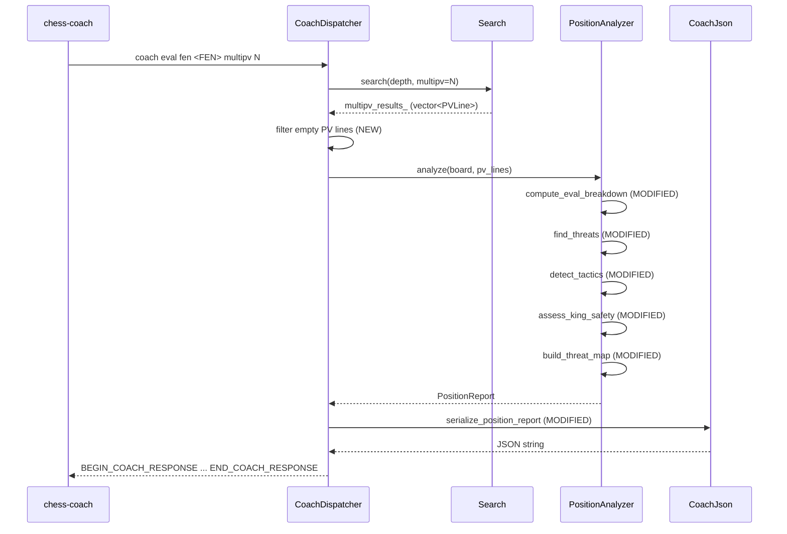

# Design Document: Coaching Improvements

## Overview

This design addresses six targeted fixes and enhancements to the Blunder engine's coaching protocol, all within the existing `PositionAnalyzer`, `CoachDispatcher`, `CoachJson`, and `Evaluator` modules. The changes are:

1. **Complete eval breakdown** — Add `tempo` and `piece_bonuses` fields to `EvalBreakdown` so the sum of components matches `eval_cp`.
2. **Fix coaching MultiPV** — Filter empty PV lines from `cmd_eval()` output so lines 2–3 contain real moves.
3. **Enriched threat descriptions** — Add `uci_move` field to `Threat` and rewrite descriptions to include UCI notation and actual target squares.
4. **Tactical motif detection** — Implement discovered attack detection on-board and in PV lines (forks, pins, skewers already exist).
5. **Position-aware king safety** — Rewrite `assess_king_safety()` to produce descriptions reflecting castling status, pawn storms, and open files.
6. **Filtered threat map** — Filter `build_threat_map()` to return only tactically interesting squares (≤16) and add a `threat_map_summary` string.

All changes are confined to four source files (`PositionAnalyzer.h`, `PositionAnalyzer.cpp`, `CoachDispatcher.cpp`, `CoachJson.cpp`) with no new classes or modules.

## Architecture

The coaching pipeline is unchanged:



No new classes, files, or dependencies are introduced. The Search module is not modified — the MultiPV fix is a post-search filter in `CoachDispatcher`.

## Components and Interfaces

### 1. EvalBreakdown struct (PositionAnalyzer.h)

Current:
```cpp
struct EvalBreakdown {
    int material;
    int mobility;
    int king_safety;
    int pawn_structure;
};
```

New:
```cpp
struct EvalBreakdown {
    int material;
    int mobility;
    int king_safety;
    int pawn_structure;
    int tempo;
    int piece_bonuses;
};
```

### 2. compute_eval_breakdown() (PositionAnalyzer.cpp)

Current implementation computes `material` as `total - pawn_structure - king_safety - mobility - piece_bonuses`, which silently absorbs tempo and piece_bonuses into material.

New implementation:
```cpp
EvalBreakdown PositionAnalyzer::compute_eval_breakdown(const Board& board)
{
    EvalBreakdown bd {};
    Board board_copy = board;
    HandCraftedEvaluator& hce = board_copy.get_hce();
    int total = hce.evaluate(board_copy);

    bd.pawn_structure = hce.get_pawn_structure_score();
    bd.king_safety    = hce.get_king_safety_score();
    bd.mobility       = hce.get_mobility_score();
    bd.piece_bonuses  = hce.get_piece_bonuses_score();

    // Tempo: +28 for white-to-move, -28 for black-to-move (white-relative)
    bd.tempo = (board_copy.side_to_move() == WHITE) ? 28 : -28;

    // Material = total minus all named sub-scores
    bd.material = total - bd.pawn_structure - bd.king_safety
                  - bd.mobility - bd.piece_bonuses - bd.tempo;

    // Convert white-relative to side-to-move perspective
    if (board.side_to_move() == BLACK) {
        bd.material       = -bd.material;
        bd.mobility       = -bd.mobility;
        bd.king_safety    = -bd.king_safety;
        bd.pawn_structure = -bd.pawn_structure;
        bd.tempo          = -bd.tempo;
        bd.piece_bonuses  = -bd.piece_bonuses;
    }
    return bd;
}
```

Key change: `tempo` is read as the constant ±28 (matching `Evaluator.cpp`'s `config_.tempo_enabled` branch), and `piece_bonuses` is read from `get_piece_bonuses_score()`. Material is now purely PSQT residual.

### 3. Threat struct (PositionAnalyzer.h)

Current:
```cpp
struct Threat {
    std::string type;
    U8 source_square;
    std::vector<U8> target_squares;
    std::string description;
};
```

New — add `uci_move` field:
```cpp
struct Threat {
    std::string type;
    U8 source_square;
    std::vector<U8> target_squares;
    std::string uci_move;       // NEW: e.g. "c4f7", "f3d6"
    std::string description;
};
```

### 4. find_threats() changes (PositionAnalyzer.cpp)

For each threat generated, populate `uci_move` with the UCI notation of the threatening move (from_square + target_square as `"a1b2"` format). Update descriptions:

- **Check threats**: Pick the first valid check-move square from `check_moves`. Set `uci_move = sq_str(source) + sq_str(check_sq)`. Set `target_squares = {check_sq}` (the actual destination, not the king square). Description: `"Nc3 can give check via c3f7"`.
- **Capture threats**: Set `uci_move = sq_str(atk_sq) + sq_str(target_sq)`. Description: `"Nf3 can capture undefended Bd6 via f3d6"`.
- **Fork/Pin/Skewer threats**: Set `uci_move` to empty string (these are positional, not single-move threats).

Helper function to build UCI string from two squares:
```cpp
static std::string uci_from_squares(U8 from, U8 to) {
    std::string s;
    s += static_cast<char>('a' + (from & 7));
    s += static_cast<char>('1' + (from >> 3));
    s += static_cast<char>('a' + (to & 7));
    s += static_cast<char>('1' + (to >> 3));
    return s;
}
```

### 5. detect_tactics() — discovered attack detection (PositionAnalyzer.cpp)

Add a new on-board section after the existing pin/skewer detection block. Algorithm:

For each own non-king piece on a line between an own slider and an opponent higher-value piece:
1. Compute the line from the slider through the blocker.
2. Remove the blocker from occupied and recompute slider attacks.
3. If the slider now attacks a higher-value opponent piece, this is a potential discovered attack.
4. Check that the blocker has at least one legal move off the line.
5. Report as `Tactic{type: "discovered_attack", in_pv: false}`.

For PV lines: after each move in the PV walk, check if the moved piece was blocking a slider ray. If moving it reveals an attack on a higher-value target, report with `in_pv: true`.

```cpp
// On-board discovered attack detection (pseudocode)
for each own_slider (bishop, rook, queen):
    for each ray_direction from slider:
        first_piece = first piece on ray
        if first_piece is own non-king piece (blocker):
            second_piece = next piece on ray beyond blocker
            if second_piece is opponent and value(second_piece) > value(blocker):
                // Check blocker can move off the line
                blocker_moves = generate_moves(blocker)
                if any move is not on the same line:
                    report discovered_attack(slider, blocker, target)
```

Implementation uses `squares_between()` and `lines_along()` (already available) plus the existing `MoveGenerator` ray functions.

### 6. assess_king_safety() rewrite (PositionAnalyzer.cpp)

Replace the current template-based description with position-aware logic:

```
1. Determine castling status:
   - King on g1/g8 → "kingside castled"
   - King on c1/c8 → "queenside castled"
   - King on e1/e8 with castling rights → "king uncastled, still has castling rights"
   - King on e1/e8 without castling rights → "king stuck in center, castling rights lost"
   - King elsewhere → "king displaced to {square}"

2. Evaluate pawn shield (existing logic, keep score computation)

3. Detect pawn storm:
   - For each file adjacent to king (±1):
     - If enemy pawn is on rank 4+ (for white king) or rank 5- (for black king):
       mark pawn_storm = true

4. Detect open files (existing logic, keep)

5. Build description string by concatenating applicable clauses:
   "{castling_status}"
   + ", solid pawn shield" | ", missing {files}-pawn shield"
   + ", pawn storm on {side}" (if detected)
   + ", open file near king" (if detected)
```

The score computation stays the same (penalty-based). Only the description generation changes.

The function needs access to castling rights. The `Board` class provides `board.castling_rights()` which returns a bitmask. We check bits for white kingside (0x1), white queenside (0x2), black kingside (0x4), black queenside (0x8).

### 7. build_threat_map() filtering (PositionAnalyzer.cpp)

Replace the current all-squares iteration with a filtered approach:

```
1. Iterate all 64 squares, compute attacker/defender counts (existing logic)
2. Include a square only if:
   a. net_attacked == true (occupied piece attacked more than defended), OR
   b. square is occupied and opponent_attackers > own_defenders, OR
   c. square is a key central square (d4/d5/e4/e5) with ≥1 attacker from either side
3. Sort included squares by priority:
   - First: occupied pieces that are net_attacked (by piece value descending)
   - Then: contested key central squares
4. Truncate to 16 entries max
5. Build threat_map_summary string from the top entries
```

### 8. PositionReport struct changes (PositionAnalyzer.h)

Add `threat_map_summary`:
```cpp
struct PositionReport {
    // ... existing fields ...
    std::vector<ThreatMapEntry> threat_map;
    std::string threat_map_summary;  // NEW
    bool critical_moment;
    std::string critical_reason;
};
```

### 9. cmd_eval() MultiPV fix (CoachDispatcher.cpp)

After `search_.get_multipv_results()`, filter out empty PV lines before passing to `PositionAnalyzer::analyze()`:

```cpp
const auto& raw_lines = search_.get_multipv_results();
std::vector<PVLine> pv_lines;
pv_lines.reserve(raw_lines.size());
for (const auto& line : raw_lines) {
    if (!line.moves.empty()) {
        pv_lines.push_back(line);
    }
}
```

This ensures `top_lines` in the JSON only contains lines with actual moves and independent evals.

### 10. CoachJson serialization changes (CoachJson.cpp)

**eval_breakdown**: Add `tempo` and `piece_bonuses` fields:
```cpp
std::string breakdown = object({
    {"material",       to_json(r.breakdown.material)},
    {"mobility",       to_json(r.breakdown.mobility)},
    {"king_safety",    to_json(r.breakdown.king_safety)},
    {"pawn_structure", to_json(r.breakdown.pawn_structure)},
    {"tempo",          to_json(r.breakdown.tempo)},
    {"piece_bonuses",  to_json(r.breakdown.piece_bonuses)}
});
```

**threats**: Add `uci_move` field to each threat object:
```cpp
elems.push_back(object({
    {"type",           to_json(t.type)},
    {"source_square",  square_to_json(t.source_square)},
    {"target_squares", array(tgt_strs)},
    {"uci_move",       to_json(t.uci_move)},
    {"description",    to_json(t.description)}
}));
```

**threat_map_summary**: Add to position report serialization:
```cpp
// After threat_map array
{"threat_map",         threat_map},
{"threat_map_summary", to_json(r.threat_map_summary)},
```

## Data Models

### JSON Schema Changes

**eval_breakdown** (before → after):
```json
{
  "material": -10,
  "mobility": 15,
  "king_safety": 5,
  "pawn_structure": -8,
  "tempo": 28,
  "piece_bonuses": 12
}
```
Sum of all six fields equals `eval_cp` (±2cp rounding tolerance).

**threat** object (before → after):
```json
{
  "type": "check",
  "source_square": "c4",
  "target_squares": ["f7"],
  "uci_move": "c4f7",
  "description": "Bc4 can give check via c4f7"
}
```

**threat_map** (before: all 32+ occupied squares; after: ≤16 filtered):
```json
{
  "threat_map": [
    {"square":"f3","piece":"knight","white_attackers":0,"black_attackers":2,
     "white_defenders":1,"black_defenders":0,"net_attacked":true}
  ],
  "threat_map_summary": "Nf3 is undefended and attacked; d5 is contested by both sides"
}
```

**tactics** — new `discovered_attack` type:
```json
{
  "type": "discovered_attack",
  "squares": ["e4", "d3", "a7"],
  "pieces": ["Bd3", "Ne4", "Ra7"],
  "in_pv": false,
  "description": "Discovered attack: Ne4 moves to reveal Bd3 attacking Ra7"
}
```

### Struct Summary

| Struct | Field Added | Type |
|--------|------------|------|
| `EvalBreakdown` | `tempo` | `int` |
| `EvalBreakdown` | `piece_bonuses` | `int` |
| `Threat` | `uci_move` | `std::string` |
| `PositionReport` | `threat_map_summary` | `std::string` |

No new structs. No fields removed (backward compatible additions only).


## Correctness Properties

*A property is a characteristic or behavior that should hold true across all valid executions of a system — essentially, a formal statement about what the system should do. Properties serve as the bridge between human-readable specifications and machine-verifiable correctness guarantees.*

### Property 1: Eval breakdown sum invariant

*For any* valid chess position, the sum `material + mobility + king_safety + pawn_structure + tempo + piece_bonuses` from `compute_eval_breakdown()` shall equal the `side_relative_eval()` result within a tolerance of ±2 centipawns, AND `tempo` shall equal +28 when it is white's turn or -28 when it is black's turn (side-to-move perspective).

**Validates: Requirements 1.2, 1.3, 1.5**

### Property 2: JSON serialization includes all new fields

*For any* `PositionReport` with arbitrary field values, serializing via `serialize_position_report()` shall produce a JSON string that contains the keys `"tempo"`, `"piece_bonuses"` (in eval_breakdown), `"uci_move"` (in each threat object), and `"threat_map_summary"` (at the top level).

**Validates: Requirements 1.4, 3.4, 6.2**

### Property 3: MultiPV filtering removes empty lines

*For any* vector of `PVLine` entries (some with empty moves vectors, some with non-empty), filtering out entries where `moves.empty()` is true shall produce a result where every remaining entry has a non-empty moves vector, and no valid entries are lost.

**Validates: Requirements 2.1, 2.3, 2.4**

### Property 4: Check and capture threats include UCI move notation

*For any* position where `find_threats()` produces threats of type `"check"` or `"capture"`, each such threat shall have a non-empty `uci_move` field of exactly 4 or 5 characters (standard UCI format), and the first two characters shall encode the `source_square`, and the description shall contain the UCI move string.

**Validates: Requirements 3.1, 3.2**

### Property 5: King safety description reflects castling status

*For any* position where the king is on g1 or g8, the `assess_king_safety()` description shall contain `"kingside castled"`. *For any* position where the king is on c1 or c8, the description shall contain `"queenside castled"`. *For any* position where the king is on e1/e8 with castling rights, the description shall contain `"uncastled"`. *For any* position where the king is on e1/e8 without castling rights, the description shall contain `"castling rights lost"`.

**Validates: Requirements 5.1, 5.2, 5.3**

### Property 6: King safety description reflects pawn storm and open files

*For any* position where enemy pawns are advanced to rank 4+ on files adjacent to the king, the `assess_king_safety()` description shall contain `"pawn storm"`. *For any* position with an open file (no pawns of either color) on or adjacent to the king's file, the description shall contain `"open file"`. *For any* position with intact pawn shield and no open files or pawn storms, the description shall indicate safety (contain `"safe"` or `"solid"`).

**Validates: Requirements 5.4, 5.5, 5.6**

### Property 7: Threat map filtering invariant

*For any* board position, every entry in the filtered `threat_map` returned by `build_threat_map()` shall satisfy at least one of: (a) `net_attacked` is true, (b) the square is occupied and opponent attackers exceed own-side defenders, or (c) the square is a key central square (d4/d5/e4/e5) with at least one attacker.

**Validates: Requirements 6.1**

### Property 8: Threat map size cap

*For any* board position, the `threat_map` array returned by `build_threat_map()` shall contain at most 16 entries.

**Validates: Requirements 6.4**

## Error Handling

No new error paths are introduced. Existing error handling in `CoachDispatcher` (invalid FEN, invalid move, parse failures) is unchanged.

- **Empty PV lines**: Handled by the new filter in `cmd_eval()` — empty lines are silently excluded rather than raising an error.
- **Missing castling rights data**: `Board::castling_rights()` always returns a valid bitmask (0 if no rights). No null/error case.
- **Threat map with 0 qualifying squares**: Returns empty array and the summary string `"no significant threats on the board"`.
- **EvalBreakdown rounding**: The ±2cp tolerance in Property 1 accounts for integer truncation in tapered evaluation. No special error handling needed.

## Testing Strategy

### Property-Based Tests

Use [rapidcheck](https://github.com/emil-e/rapidcheck) (C++ property-based testing library, already compatible with the project's CMake/Catch2 setup). Each property test runs a minimum of 100 iterations with randomly generated board positions.

**Generator strategy**: Use a custom `Arbitrary<Board>` generator that produces valid chess positions by:
1. Placing kings on random non-adjacent squares
2. Adding 0–15 random pieces per side (respecting piece limits)
3. Setting random side-to-move and castling rights (consistent with king/rook positions)

Each property-based test must be tagged with a comment referencing the design property:
```
// Feature: coaching-improvements, Property 1: Eval breakdown sum invariant
```

**Property tests to implement:**
- Property 1: Generate random boards → `compute_eval_breakdown()` sum ≈ `side_relative_eval()`
- Property 2: Generate random PositionReport → serialize → check JSON keys present
- Property 3: Generate random `vector<PVLine>` → filter → all remaining have non-empty moves
- Property 4: Generate random boards → `find_threats()` → check/capture threats have valid `uci_move`
- Property 5: Generate boards with king on specific squares → `assess_king_safety()` → check description keywords
- Property 6: Generate boards with specific pawn configurations → `assess_king_safety()` → check description keywords
- Property 7: Generate random boards → `build_threat_map()` → every entry meets inclusion criteria
- Property 8: Generate random boards → `build_threat_map()` → length ≤ 16

### Unit Tests (Examples and Edge Cases)

- **Eval breakdown**: Starting position after 1.e4 — verify all six fields are populated and sum matches eval_cp.
- **MultiPV filtering**: Mock vector with 3 PVLines (1 populated, 2 empty) → filter → 1 result.
- **Threat UCI moves**: Italian Game position (Bc4 threatens f7) — verify `uci_move` is `"c4f7"` and description includes it.
- **Tactical motifs**: Known fork position (Nc7 forking Ra8 and Ke8) — verify `type: "fork"` detected.
- **Discovered attack**: Position with bishop behind knight on same diagonal to opponent queen — verify `type: "discovered_attack"`.
- **Pin/Skewer**: Known pin position — verify detection.
- **King safety descriptions**: Castled kingside position → description contains "kingside castled". Uncastled with rights → "uncastled". Center king without rights → "castling rights lost". Pawn storm position → "pawn storm".
- **Threat map filtering**: Position with many attacked squares → verify ≤16 entries. Position with no threats → empty array + "no significant threats" summary.
- **Empty threat map**: Bare kings position → empty threat_map, summary = "no significant threats on the board".

### Test Configuration

- Property tests: minimum 100 iterations each
- Each property test tagged: `Feature: coaching-improvements, Property {N}: {title}`
- Each correctness property implemented by a single property-based test
- Unit tests use Catch2 `TEST_CASE` with descriptive names
- All tests in `test/source/TestCoachingImprovements.cpp`
