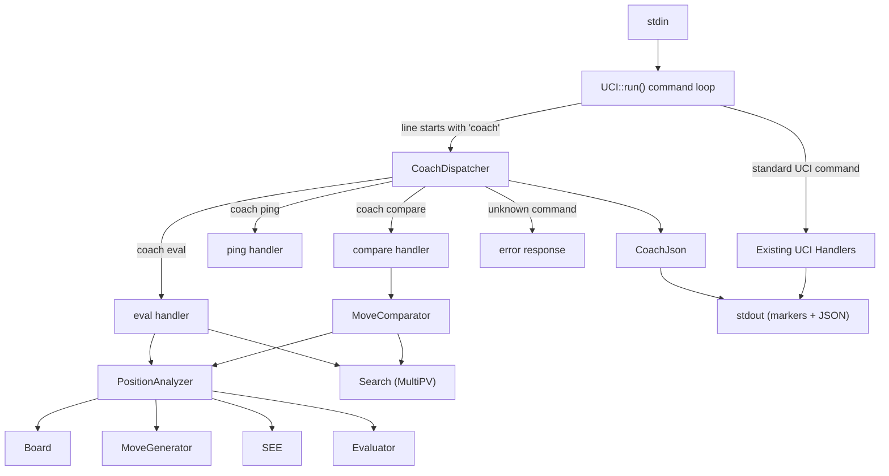

# Design Document: Coaching Protocol (Engine Side)

## Overview

This design adds the Coaching Protocol to Blunder's engine, extending the existing UCI command loop with three new `coach`-prefixed commands: `coach ping`, `coach eval`, and `coach compare`. These commands return rich, structured evaluation data as JSON wrapped in `BEGIN_COACH_RESPONSE` / `END_COACH_RESPONSE` markers over the same stdin/stdout pipe used for UCI.

The implementation introduces four new components into the existing architecture:

1. **CoachDispatcher** — Plugs into the UCI command loop to recognize `coach` commands and route them to the appropriate handler. Owns the response framing (markers + JSON envelope).
2. **PositionAnalyzer** — Inspects a `Board` to extract structured data: evaluation breakdown, hanging pieces, threats, pawn structure, king safety, threat map, tactics, and critical moment detection.
3. **MoveComparator** — Compares a user's move against the engine's best move, computing eval drop, classification, NAG, refutation lines, and missed tactics.
4. **CoachJson** — Lightweight JSON serialization utilities (no external dependency). Builds compact JSON strings from C++ data structures.

Key design decisions:
- The coaching layer is a thin shell around existing engine capabilities (Search, Evaluator, MoveGenerator, Board, SEE). It does not modify any core engine algorithms.
- JSON is built with a simple string-builder approach rather than pulling in a JSON library. The protocol's JSON schemas are fixed and shallow, making a full JSON library unnecessary.
- The `PositionAnalyzer` is a stateless utility class that takes a `const Board&` and returns structured data. This keeps it testable in isolation.
- The `coach eval` command depends on MultiPV search (from the `uci-multipv` spec) for `top_lines` and `critical_moment` detection.
- All `eval_cp` values are from the side-to-move perspective, consistent with the existing `side_relative_eval()` convention.
- The `theme` field in `top_lines` and the `best_move_idea` field in `coach compare` use heuristic labeling based on move characteristics (e.g., pawn breaks, piece development, castling). These are short labels, not LLM-generated prose — the chess-coach client is responsible for natural language explanations.

## Architecture



### Integration with UCI::run()

The `UCI::run()` command loop currently dispatches commands via a `handlers_` map keyed by the first token. The coaching protocol integrates by adding a single entry for the `"coach"` key that delegates to `CoachDispatcher`:

```cpp
// In UCI::init_handlers()
handlers_["coach"] = [this](const std::string& args) { coach_dispatcher_.dispatch(args); };
```

This means:
- All existing UCI commands continue to work unchanged (Requirement 16)
- The `coach` token is consumed by the existing tokenizer; the rest of the line is passed as `args`
- `CoachDispatcher::dispatch()` parses the subcommand name from `args` and routes accordingly
- Processing is synchronous — the response is fully written to stdout before `run()` reads the next line (Requirement 16.2)

### CoachDispatcher Ownership

`CoachDispatcher` is owned by `UCI` as a member. It holds references to `Board&` and `Search&` (the same instances UCI owns), so it can set up positions and run searches without duplicating state.

## Components and Interfaces

### CoachDispatcher

```cpp
class CoachDispatcher {
public:
    CoachDispatcher(Board& board, Search& search, NNUEEvaluator* nnue);

    // Main entry point: parse subcommand and route
    void dispatch(const std::string& args);

private:
    void cmd_ping();
    void cmd_eval(const std::string& args);
    void cmd_compare(const std::string& args);

    // Response framing
    void send_response(const std::string& json);
    void send_error(const std::string& code, const std::string& message);

    // JSON envelope builder
    std::string wrap_envelope(const std::string& type, const std::string& data_json) const;

    Board& board_;
    Search& search_;
    NNUEEvaluator* nnue_;
};
```

`send_response()` writes the three-line block to stdout:
```
BEGIN_COACH_RESPONSE
<json>
END_COACH_RESPONSE
```

`send_error()` is a convenience that builds an error envelope and calls `send_response()`.

### PositionAnalyzer

Stateless utility that extracts structured data from a board position. Each method returns a data struct that `CoachDispatcher` serializes to JSON.

```cpp
struct EvalBreakdown {
    int material;
    int mobility;
    int king_safety;
    int pawn_structure;
};

struct HangingPiece {
    U8 square;
    U8 piece;  // piece type without color (PAWN, KNIGHT, etc.)
};

struct Threat {
    std::string type;        // "check", "capture", "fork", "pin", "skewer", "discovered_attack"
    U8 source_square;
    std::vector<U8> target_squares;
    std::string description;
};

struct PawnFeatures {
    std::vector<int> isolated;  // file indices (0-7)
    std::vector<int> doubled;
    std::vector<int> passed;
};

struct KingSafety {
    int score;
    std::string description;
};

struct ThreatMapEntry {
    U8 square;
    U8 piece;           // EMPTY if no piece
    int white_attackers;
    int black_attackers;
    int white_defenders;
    int black_defenders;
    bool net_attacked;
};

struct Tactic {
    std::string type;    // "fork", "pin", "skewer", etc.
    std::vector<U8> squares;
    std::vector<std::string> pieces;  // e.g. "Nc7", "Ra8"
    bool in_pv;
    std::string description;
};

struct PositionReport {
    std::string fen;
    int eval_cp;
    EvalBreakdown breakdown;
    std::vector<HangingPiece> hanging_white;
    std::vector<HangingPiece> hanging_black;
    std::vector<Threat> threats_white;
    std::vector<Threat> threats_black;
    PawnFeatures pawns_white;
    PawnFeatures pawns_black;
    KingSafety king_safety_white;
    KingSafety king_safety_black;
    std::vector<PVLine> top_lines;  // reuses PVLine from Search.h
    std::vector<Tactic> tactics;
    std::vector<ThreatMapEntry> threat_map;
    bool critical_moment;
    std::string critical_reason;  // empty when not critical
};

class PositionAnalyzer {
public:
    // Full position analysis (used by coach eval)
    static PositionReport analyze(const Board& board,
                                  const std::vector<PVLine>& pv_lines);

    // Individual analysis components (testable in isolation)
    static EvalBreakdown compute_eval_breakdown(const Board& board);
    static std::vector<HangingPiece> find_hanging_pieces(const Board& board, U8 side);
    static std::vector<Threat> find_threats(const Board& board, U8 side);
    static PawnFeatures analyze_pawns(const Board& board, U8 side);
    static KingSafety assess_king_safety(const Board& board, U8 side);
    static std::vector<ThreatMapEntry> build_threat_map(const Board& board);
    static std::vector<Tactic> detect_tactics(const Board& board,
                                               const std::vector<PVLine>& pv_lines);
    static bool is_critical_moment(const std::vector<PVLine>& pv_lines,
                                    std::string& reason);
    static std::string label_line_theme(const Board& board, const std::vector<Move_t>& moves);
};
```

#### Eval Breakdown Implementation

The `HandCraftedEvaluator` currently computes a single tapered score. To decompose it, `compute_eval_breakdown()` will:

1. **Material**: Sum piece values for each side using `PIECE_VALUE_BONUS` tables, tapered by game phase. Return `white_material - black_material`.
2. **Mobility**: Count legal moves for each side (already done in `evaluate()` when `mobility_enabled`). Return `20 * (white_moves - black_moves)` scaled by phase.
3. **King Safety**: Evaluate pawn shield around each king. Count missing shield pawns on the king's file and adjacent files. Return the difference.
4. **Pawn Structure**: Compute isolated/doubled/passed pawn penalties and bonuses from the PSQT pawn table contributions. Return the structural component.

The sum of these four components will approximately equal `eval_cp` (the full evaluation). Small discrepancies are acceptable due to the tempo bonus and PSQT positional bonuses that don't cleanly decompose.

When NNUE is active, the breakdown falls back to the HCE decomposition as an approximation, since NNUE is a black-box neural network. The overall `eval_cp` still comes from NNUE.

#### Hanging Pieces Detection

Uses `MoveGenerator::attacks_to()` to count attackers and defenders for each occupied square. A piece is "hanging" when it is attacked by the opponent more times than defended by its own side. Kings are excluded.

#### Threat Detection

Scans for immediate tactical threats:
- **Check**: Generate moves for the opponent; any move that gives check is a check threat.
- **Capture**: Opponent pieces that can capture undefended or higher-value pieces.
- **Fork**: A piece that attacks two or more higher-value pieces simultaneously (using attack bitboards).
- **Pin**: A sliding piece that attacks through a less-valuable piece to a more-valuable piece behind it (using `lines_along()` and `squares_between()`).
- **Skewer**: Like a pin but the more-valuable piece is in front.
- **Discovered Attack**: Moving a piece reveals an attack from a sliding piece behind it.

#### Pawn Structure Analysis

Uses bitboard operations on `board.bitboard(WHITE_PAWN)` / `board.bitboard(BLACK_PAWN)`:
- **Isolated**: A pawn whose adjacent files have no friendly pawns. Check `file_mask(file-1) | file_mask(file+1)` intersection with friendly pawns.
- **Doubled**: Multiple friendly pawns on the same file. Count pawns per file using `pop_count(file_mask(f) & friendly_pawns)`.
- **Passed**: A pawn with no opposing pawns on its file or adjacent files ahead of it.

#### King Safety Assessment

Evaluates the pawn shield around each king:
- Count pawns on the king's file and adjacent files within 1-2 ranks ahead.
- Check for open files near the king.
- Generate a score and human-readable description (e.g., "king safe behind pawns", "king exposed, missing g-pawn shield").

#### Threat Map

Iterates over all 64 squares. For each square that is attacked or contains a piece:
- Count white attackers using `attacks_to()` filtered by white pieces.
- Count black attackers similarly.
- Defenders are attackers of the same color as the piece on the square.
- `net_attacked` = piece is attacked more times than defended by its own side.

Only squares with non-zero attack counts or containing pieces are included (to keep the array manageable).

#### Tactics Detection

Combines on-board pattern detection with PV analysis:
- On-board: Scan for forks, pins, skewers, discovered attacks, back-rank threats, overloaded pieces using the same logic as threat detection but with broader scope.
- In-PV: Walk each PV line, apply moves to a board copy, and check for tactical motifs at each position. Mark these with `in_pv: true`.

#### Critical Moment Detection

Compares the eval of the best PV line against the 3rd-best (or last available if fewer than 3). If the spread exceeds 100 centipawns, the position is critical. The reason string describes why (e.g., "best move wins material, alternatives lose the advantage").

#### Line Theme Labeling

Heuristic labeling based on the first few moves of a PV line:
- Pawn moves to center → "central pawn break"
- Castling in the line → "king safety, castling"
- Piece development moves → "piece development"
- Captures of high-value pieces → "material win"
- Checks → "king attack"

Returns a short string like `"kingside attack"`, `"central control"`, `"piece development"`.

### MoveComparator

```cpp
struct ComparisonReport {
    std::string fen;
    std::string user_move;      // UCI notation
    int user_eval_cp;
    std::string best_move;      // UCI notation
    int best_eval_cp;
    int eval_drop_cp;
    std::string classification; // "good", "inaccuracy", "mistake", "blunder"
    std::string nag;            // "!!", "!", "!?", "?!", "?", "??"
    std::string best_move_idea;
    std::vector<std::string> refutation_line;  // empty if not blunder
    std::vector<Tactic> missed_tactics;
    std::vector<PVLine> top_lines;
    bool critical_moment;
    std::string critical_reason;
};

class MoveComparator {
public:
    static ComparisonReport compare(Board& board, Search& search,
                                     Move_t user_move, int multipv_count = 3);

    // Classification helpers (testable in isolation)
    static std::string classify(int eval_drop_cp);
    static std::string compute_nag(int eval_drop_cp, bool is_best_move);
    static std::string describe_best_move(const Board& board, Move_t best_move,
                                           const std::vector<Move_t>& pv_moves);
};
```

#### Compare Flow

1. Run MultiPV search on the position to get top lines and the best move.
2. If the user's move equals the best move, `eval_drop_cp = 0`.
3. Otherwise, apply the user's move to a board copy, run a search from the resulting position, negate the score (to get it from the original side-to-move perspective), and compute `eval_drop_cp = best_eval_cp - user_eval_cp`.
4. Classify and assign NAG based on `eval_drop_cp` thresholds.
5. If classification is `"blunder"`, extract the refutation line from the search after the user's move (the opponent's best continuation).
6. Detect missed tactics by comparing tactics in the best line vs. tactics after the user's move.
7. Populate `top_lines`, `critical_moment`, and `critical_reason` from the MultiPV results.

### CoachJson

Lightweight JSON string builder. No external dependencies.

```cpp
namespace CoachJson {
    // Primitive serializers
    std::string to_json(int value);
    std::string to_json(bool value);
    std::string to_json(const std::string& value);  // escapes special chars
    std::string to_json_null();

    // Array/object builders
    std::string array(const std::vector<std::string>& elements);
    std::string object(const std::vector<std::pair<std::string, std::string>>& fields);

    // High-level serializers
    std::string serialize_position_report(const PositionReport& report);
    std::string serialize_comparison_report(const ComparisonReport& report);
    std::string serialize_pong(const std::string& engine_name, const std::string& engine_version);
    std::string serialize_error(const std::string& code, const std::string& message);
}
```

The `to_json(const std::string&)` function escapes `"`, `\`, and control characters per the JSON spec. This is critical for correctness since descriptions may contain special characters.

## Data Models

### Response Envelope

Every coaching response follows this structure:

| Field | Type | Value |
|-------|------|-------|
| `protocol` | string | `"coaching"` (constant) |
| `version` | string | `"1.0.0"` (constant for this implementation) |
| `type` | string | `"pong"`, `"position_report"`, `"comparison_report"`, or `"error"` |
| `data` | object | Payload (schema depends on `type`) |

### Classification Thresholds

| eval_drop_cp | Classification | NAG |
|-------------|----------------|-----|
| 0-10 | good | `!` |
| 11-30 | good | `!?` |
| 31-100 | inaccuracy | `?!` |
| 101-300 | mistake | `?` |
| > 300 | blunder | `??` |

Special: `user_move == best_move` → NAG is `!` (or `!!` for brilliant).

### File Layout

New files:
- `source/CoachDispatcher.h` / `source/CoachDispatcher.cpp`
- `source/PositionAnalyzer.h` / `source/PositionAnalyzer.cpp`
- `source/MoveComparator.h` / `source/MoveComparator.cpp`
- `source/CoachJson.h` / `source/CoachJson.cpp`
- `test/source/TestCoachProtocol.cpp`
- `test/source/TestPositionAnalyzer.cpp`
- `test/source/TestMoveComparator.cpp`
- `test/source/TestCoachJson.cpp`

Modified files:
- `source/UCI.h` — Add `CoachDispatcher` member, `#include "CoachDispatcher.h"`
- `source/UCI.cpp` — Add `"coach"` handler in `init_handlers()`
- `CMakeLists.txt` (root) — Add new source files to `blunder_lib`
- `test/CMakeLists.txt` — Add new test files to `blunder_test`


## Correctness Properties

*A property is a characteristic or behavior that should hold true across all valid executions of a system — essentially, a formal statement about what the system should do. Properties serve as the bridge between human-readable specifications and machine-verifiable correctness guarantees.*

### Property 1: Response framing and envelope structure

*For any* coaching command (ping, eval, compare, or unknown), the stdout output SHALL contain exactly one `BEGIN_COACH_RESPONSE` line followed by exactly one line of valid JSON followed by exactly one `END_COACH_RESPONSE` line, with no leading or trailing whitespace on the marker lines. The JSON SHALL parse to an object containing `"protocol": "coaching"`, `"version": "1.0.0"`, a `"type"` string, and a `"data"` object.

**Validates: Requirements 2.1, 2.2, 2.3**

### Property 2: Command routing correctness

*For any* input line starting with `coach` followed by a known subcommand (`ping`, `eval`, `compare`), the response type SHALL match the expected type (`"pong"`, `"position_report"`, `"comparison_report"` respectively). *For any* input line starting with `coach` followed by an unrecognized subcommand, the response type SHALL be `"error"` with code `"unknown_command"`.

**Validates: Requirements 1.1, 1.3**

### Property 3: UCI non-interference

*For any* sequence of interleaved coaching commands and standard UCI commands, the UCI commands SHALL produce identical output to the same UCI commands sent without coaching commands present.

**Validates: Requirements 1.2, 16.1**

### Property 4: Eval breakdown approximates total eval

*For any* chess position, the sum of `eval_breakdown.material + eval_breakdown.mobility + eval_breakdown.king_safety + eval_breakdown.pawn_structure` SHALL be within 50 centipawns of the overall `eval_cp` value.

**Validates: Requirements 5.1, 5.2**

### Property 5: Hanging pieces correctness

*For any* chess position and any piece reported as hanging, the piece SHALL be attacked by the opponent more times than it is defended by its own side (verified independently via `MoveGenerator::attacks_to()`). Conversely, *for any* non-king piece that is attacked more than defended, it SHALL appear in the hanging pieces list.

**Validates: Requirements 6.1, 6.2**

### Property 6: Pawn structure correctness

*For any* chess position, a file SHALL appear in the `isolated` array if and only if the side has a pawn on that file with no friendly pawns on adjacent files. A file SHALL appear in the `doubled` array if and only if the side has more than one pawn on that file. A file SHALL appear in the `passed` array if and only if the side has a pawn on that file with no opposing pawns on the same or adjacent files ahead of it.

**Validates: Requirements 8.1, 8.2**

### Property 7: Threat map attacker/defender counts

*For any* chess position and any entry in the threat map, the `white_attackers` and `black_attackers` counts SHALL equal the number of white and black pieces (respectively) that attack that square, as computed independently via `MoveGenerator::attacks_to()`. The `net_attacked` field SHALL be `true` if and only if the piece on the square is attacked by the opponent more times than defended by its own side.

**Validates: Requirements 10.1, 10.2, 10.3**

### Property 8: Critical moment detection

*For any* set of PV lines, `critical_moment` SHALL be `true` if and only if the eval spread between the best line and the 3rd-best line (or last available line if fewer than 3) exceeds 100 centipawns. When `critical_moment` is `true`, `critical_reason` SHALL be a non-empty string. When `critical_moment` is `false`, `critical_reason` SHALL be null.

**Validates: Requirements 12.1, 12.2, 12.3**

### Property 9: Classification and NAG thresholds

*For any* integer `eval_drop_cp >= 0`, the classification SHALL be `"good"` when `eval_drop_cp <= 30`, `"inaccuracy"` when `31 <= eval_drop_cp <= 100`, `"mistake"` when `101 <= eval_drop_cp <= 300`, and `"blunder"` when `eval_drop_cp > 300`. The NAG SHALL be `"!"` when `eval_drop_cp <= 10`, `"!?"` when `11 <= eval_drop_cp <= 30`, `"?!"` when `31 <= eval_drop_cp <= 100`, `"?"` when `101 <= eval_drop_cp <= 300`, and `"??"` when `eval_drop_cp > 300`.

**Validates: Requirements 13.3, 13.4**

### Property 10: Eval drop non-negativity

*For any* comparison report, `eval_drop_cp` SHALL be greater than or equal to 0, and SHALL equal `best_eval_cp - user_eval_cp`.

**Validates: Requirements 13.2**

### Property 11: Refutation line presence

*For any* comparison report, `refutation_line` SHALL be non-null and non-empty if and only if the classification is `"blunder"`. When the classification is not `"blunder"`, `refutation_line` SHALL be null.

**Validates: Requirements 14.1, 14.2**

### Property 12: Error responses for invalid input

*For any* invalid FEN string provided to `coach eval` or `coach compare`, the response SHALL be an error with code `"invalid_fen"`. *For any* legal position and illegal move provided to `coach compare`, the response SHALL be an error with code `"invalid_move"`.

**Validates: Requirements 15.1, 15.2**

### Property 13: JSON round-trip

*For any* valid coaching response JSON payload, parsing the JSON string into a data structure and re-serializing it in compact form SHALL produce a byte-identical JSON string.

**Validates: Requirements 17.1, 17.2, 17.3**

### Property 14: MultiPV count in eval

*For any* valid position and multipv parameter N, the `top_lines` array in the position report SHALL contain `min(N, legal_moves)` entries. When multipv is omitted, the default SHALL be 3.

**Validates: Requirements 4.2**

### Property 15: Position report field completeness

*For any* position report, the response SHALL contain all required fields: `fen`, `eval_cp`, `eval_breakdown` (with `material`, `mobility`, `king_safety`, `pawn_structure`), `hanging_pieces` (with `white` and `black` arrays), `threats` (with `white` and `black` arrays), `pawn_structure` (with `white` and `black` objects each containing `isolated`, `doubled`, `passed`), `king_safety` (with `white` and `black` objects each containing `score` and `description`), `top_lines` (each with `depth`, `eval_cp`, `moves`, `theme`), `tactics`, `threat_map`, `critical_moment`, and `critical_reason`.

**Validates: Requirements 4.3, 4.4, 5.1, 7.2, 8.2, 9.1, 10.2, 11.2**

## Error Handling

| Scenario | Handling | Error Code |
|----------|----------|------------|
| Invalid FEN in `coach eval` or `coach compare` | `Parser::parse_fen()` throws; catch and return error envelope | `invalid_fen` |
| Illegal move in `coach compare` | `Parser::move()` returns `std::nullopt` or `is_valid_move()` returns false; return error envelope | `invalid_move` |
| Unknown coach subcommand | `dispatch()` doesn't match any known command; return error envelope | `unknown_command` |
| Unexpected exception during processing | Top-level catch in `dispatch()`; return error envelope | `internal_error` |
| Game-over position in `coach eval` | Return report with `eval_cp: 0` and empty arrays for tactics/threats | N/A (valid response) |
| FEN missing fields | `Parser::parse_fen()` throws on incomplete FEN | `invalid_fen` |
| MultiPV count exceeds legal moves | Capped by `min(N, legal_moves)` in search | N/A (valid response) |
| Search timeout during eval/compare | Use results from last completed depth (same as UCI search behavior) | N/A (valid response) |
| NNUE not loaded | Fall back to HandCraftedEvaluator (existing behavior) | N/A (transparent) |
| Empty stdin line after `coach` | Treated as unknown command | `unknown_command` |

The `dispatch()` method wraps all command handling in a try-catch block:

```cpp
void CoachDispatcher::dispatch(const std::string& args) {
    try {
        // parse subcommand and route...
    } catch (const std::exception& e) {
        send_error("internal_error", e.what());
    } catch (...) {
        send_error("internal_error", "Unknown error occurred");
    }
}
```

This ensures that any unhandled exception still produces a valid coaching response rather than corrupting the stdout stream.

## Testing Strategy

### Test Framework

- **Catch2 v3.4.0** (already used by the project)
- Property-based tests use Catch2's `GENERATE` with random seeds and curated FEN positions
- Each property test runs a minimum of 100 iterations
- Tests are organized into four test files by component

### Unit Tests (Examples and Edge Cases)

1. **Ping response** — Send `coach ping`, verify response type is `"pong"` with correct `status`, `engine_name`, `engine_version` fields (Req 3.1, 3.2)
2. **Eval on starting position** — Send `coach eval fen <starting_fen>`, verify all fields present with reasonable values (Req 4.1-4.4)
3. **Eval with explicit multipv** — Send `coach eval fen <fen> multipv 5`, verify 5 top_lines returned (Req 4.2)
4. **Compare best move** — Send `coach compare` where user's move is the best move, verify `eval_drop_cp == 0`, NAG is `"!"` (Req 13.5)
5. **Compare blunder** — Use Scholar's mate position, verify `classification == "blunder"`, `refutation_line` is non-null (Req 14.1)
6. **Invalid FEN error** — Send `coach eval fen not-a-fen`, verify error with code `"invalid_fen"` (Req 15.1)
7. **Invalid move error** — Send `coach compare` with illegal move, verify error with code `"invalid_move"` (Req 15.2)
8. **Unknown command error** — Send `coach foobar`, verify error with code `"unknown_command"` (Req 1.3)
9. **Internal error handling** — Verify that exceptions produce `"internal_error"` responses (Req 15.3)
10. **Game-over position** — Eval a checkmate position, verify `eval_cp: 0` and empty arrays
11. **Pawn structure known position** — Position with known isolated/doubled/passed pawns, verify detection
12. **Hanging piece known position** — Position with a known hanging piece, verify detection
13. **Critical moment known position** — Position where best move wins material and alternatives don't

### Property-Based Tests

Each property test references its design document property and runs across multiple FEN positions.

- **Feature: coaching-protocol, Property 1: Response framing and envelope structure** — For each coaching command type, verify marker framing and envelope fields
- **Feature: coaching-protocol, Property 2: Command routing correctness** — Generate random subcommand names, verify routing
- **Feature: coaching-protocol, Property 3: UCI non-interference** — Interleave coaching and UCI commands, verify UCI output unchanged
- **Feature: coaching-protocol, Property 4: Eval breakdown approximates total eval** — For diverse positions, verify sum ≈ eval_cp
- **Feature: coaching-protocol, Property 5: Hanging pieces correctness** — For diverse positions, verify hanging pieces match independent computation
- **Feature: coaching-protocol, Property 6: Pawn structure correctness** — For diverse positions, verify isolated/doubled/passed detection
- **Feature: coaching-protocol, Property 7: Threat map attacker/defender counts** — For diverse positions, verify counts match attacks_to()
- **Feature: coaching-protocol, Property 8: Critical moment detection** — Generate PV line sets with known spreads, verify critical_moment
- **Feature: coaching-protocol, Property 9: Classification and NAG thresholds** — Generate random eval_drop_cp values 0-1000, verify classification and NAG
- **Feature: coaching-protocol, Property 10: Eval drop non-negativity** — For diverse positions and moves, verify eval_drop_cp >= 0
- **Feature: coaching-protocol, Property 11: Refutation line presence** — For diverse comparison reports, verify refutation_line ↔ blunder
- **Feature: coaching-protocol, Property 12: Error responses for invalid input** — Generate random invalid FEN strings and illegal moves, verify error codes
- **Feature: coaching-protocol, Property 13: JSON round-trip** — For all response types, parse and re-serialize, verify byte-identical output
- **Feature: coaching-protocol, Property 14: MultiPV count in eval** — For diverse positions and N values, verify top_lines count
- **Feature: coaching-protocol, Property 15: Position report field completeness** — For diverse positions, verify all required fields present

### Property-Based Testing Configuration

- Library: Catch2 `GENERATE` with `GENERATE(take(100, random(...)))` for numeric parameters
- Curated set of diverse FEN positions covering: opening, middlegame, endgame, positions with tactical motifs, positions with pawn weaknesses, positions with exposed kings
- Minimum 100 iterations per property test
- Each test tagged with: `Feature: coaching-protocol, Property N: <property_text>`
- Each correctness property is implemented by a single property-based test
- Test files:
  - `test/source/TestCoachProtocol.cpp` — Properties 1, 2, 3 (framing, routing, UCI coexistence)
  - `test/source/TestPositionAnalyzer.cpp` — Properties 4, 5, 6, 7, 8, 14, 15 (analysis components)
  - `test/source/TestMoveComparator.cpp` — Properties 9, 10, 11 (classification, eval drop, refutation)
  - `test/source/TestCoachJson.cpp` — Properties 12, 13 (error responses, JSON round-trip)
