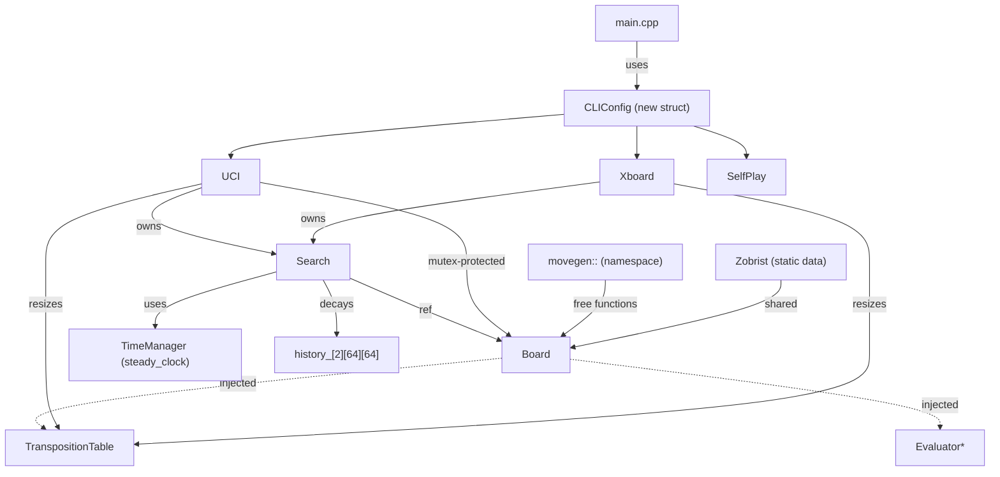

# Design Document: Code Quality Hardening

## Overview

This design covers 23 code quality improvements for the Blunder chess engine. The changes span six categories:

1. **Code modernization** (Requirements 3–7, 20–22): Replace C-isms with modern C++17 idioms — `constexpr`, `<cassert>`, scoped constants, declare-at-use, namespace conversion, Zobrist singleton, signed score type.
2. **Architecture cleanup** (Requirements 1–2, 8): Extract shared CLI parsing, inject Board dependencies, relocate test-only code.
3. **Protocol correctness** (Requirements 9–11, 18): UCI `go ponder`, thread safety, TT resize wiring, castling notation fix.
4. **Performance micro-optimizations** (Requirements 12–14, 17): Compiler intrinsic `pop_count`, pre-reserved accumulator stack, bitmask TT indexing, optimized `is_draw`.
5. **Bug fixes** (Requirements 15–16): History table aging, `adjust_for_score` repeated-application fix.
6. **Tooling** (Requirement 23): `--output` flag for `analyze-sts.py`.
7. **Timing modernization** (Requirement 19): Replace `clock()` with `std::chrono::steady_clock`.

All changes are strength-neutral by design — they improve maintainability, correctness, and micro-performance without altering search or evaluation algorithms.

## Architecture

The changes touch nearly every component but do not alter the fundamental architecture. The dependency graph shifts slightly:



Key architectural changes:

- **Board** loses ownership of `TranspositionTable` and evaluators. They become injected references/pointers. `get_evaluator()` is removed; callers choose the evaluator.
- **MoveGenerator** becomes a namespace `movegen::` (or `MoveGenerator::`) instead of a class with static methods.
- **Zobrist** keys become static data shared across all Board instances.
- **UCI** gains a `std::mutex` protecting `board_` during search, and supports `go ponder` / `ponderhit`.
- **TranspositionTable** gains `resize(int mb)`, enforces power-of-two sizing, and uses bitmask indexing.
- **TimeManager** and **SearchStats** switch from `clock()` to `std::chrono::steady_clock`.
- **main.cpp** extracts a `CLIConfig` struct + parser function, eliminating the triplicated MCTS/AlphaZero/NNUE blocks.

## Components and Interfaces

### CLIConfig (Requirement 1)

```cpp
// source/CLIConfig.h
struct CLIConfig {
    bool use_mcts = false;
    int mcts_simulations = 800;
    double mcts_cpuct = 1.41;
    bool alphazero_mode = false;
    std::string nnue_path;
    std::string book_path;
    std::string dual_head_path;
};

/// Parse MCTS/AlphaZero/NNUE flags from argc/argv into config.
/// Returns the protocol mode string ("xboard", "uci", "selfplay", etc.)
std::string parse_cli(int argc, char** argv, CLIConfig& config);
```

### Board Dependency Injection (Requirement 2)

```cpp
class Board {
public:
    Board();  // default-constructs with internal default TT
    explicit Board(TranspositionTable& tt);  // injected TT

    void set_evaluator(Evaluator* eval);  // caller-selected evaluator
    void set_nnue(NNUEEvaluator* nnue);

    // get_evaluator() REMOVED — caller decides which evaluator to use
    TranspositionTable& get_tt();

private:
    TranspositionTable default_tt_;       // fallback if none injected
    TranspositionTable* tt_ = &default_tt_;
    NNUEEvaluator* nnue_ = nullptr;
    // evaluator_ removed from Board; owned by caller
};
```

### TranspositionTable Changes (Requirements 11, 14)

```cpp
class TranspositionTable {
public:
    explicit TranspositionTable(int size_mb = 16);

    void resize(int size_mb);  // NEW: reallocate to ~N MB, clears entries
    void clear();
    int probe(U64 hash, int depth, int alpha, int beta, Move_t& best_move);
    void record(U64 hash, int depth, int val, int flags, Move_t best_move);

private:
    std::vector<HASHE> table_;
    size_t mask_;  // NEW: size_ - 1, used for bitmask indexing
    
    size_t index(U64 hash) const { return hash & mask_; }  // replaces hash % size
};
```

### UCI Ponder & Thread Safety (Requirements 9, 10)

```cpp
class UCI {
    // ...
    void cmd_go(const std::string& args);      // parses "ponder" flag
    void cmd_ponderhit();                       // NEW handler
    void cmd_stop();                            // stops ponder or normal search

private:
    std::mutex board_mutex_;                    // NEW: protects board_ access
    bool pondering_ = false;                    // NEW: tracks ponder state
};
```

### TimeManager Changes (Requirements 16, 19)

```cpp
class TimeManager {
public:
    void allocate(int time_left_cs, int inc_cs, int moves_to_go);
    void start(int search_time, int max_nodes = -1);
    void adjust_for_score(int score_cp);  // now applies at most once per cycle

    bool is_time_over(int nodes_visited) const;
    bool should_stop(int nodes_visited) const;

private:
    std::chrono::steady_clock::time_point start_time_;  // replaces clock_t
    bool score_adjusted_ = false;  // NEW: prevents repeated application
    // ...
};
```

### SearchStats Changes (Requirement 19)

```cpp
struct SearchStats {
    std::chrono::steady_clock::time_point start_time;  // replaces clock_t
    // ...
    void reset() { start_time = std::chrono::steady_clock::now(); /* ... */ }
    double elapsed_secs() const;  // uses steady_clock duration
};
```

### Search History Aging (Requirement 15)

```cpp
class Search {
    // Between iterative deepening iterations:
    void age_history();  // NEW: halves all history_[side][from][to] values
};
```

### MoveGenerator → Namespace (Requirement 22)

```cpp
// source/MoveGenerator.h
namespace MoveGenerator {
    void init_magic_tables();
    void add_all_moves(Board& board, MoveList& list);
    void add_loud_moves(Board& board, MoveList& list);
    void score_moves(Board& board, MoveList& list, Move_t hash_move);
    int see(Board& board, Move_t move);
    // ... all former static methods become free functions
}
```

### Zobrist Static Data (Requirement 20)

```cpp
class Zobrist {
public:
    // All key arrays become static — initialized once
    static U64 pieces[NUM_PIECES][NUM_SQUARES];
    static U64 castling_rights[FULL_CASTLING_RIGHTS + 1];
    static U64 ep_square[NUM_SQUARES];
    static U64 side;

    static void init();  // called once from main()

    // Instance methods become static
    static U64 get_zobrist_key(const Board& board);
    static U64 get_pieces(U8 piece, int square) { return pieces[piece][square]; }
    // ...
};
```

### pop_count Intrinsic (Requirement 12)

```cpp
inline int pop_count(U64 x) {
#if defined(__GNUC__) || defined(__clang__)
    return __builtin_popcountll(x);
#elif defined(_MSC_VER)
    return static_cast<int>(__popcnt64(x));
#else
    // fallback: manual loop
    int count = 0;
    while (x) { count++; x &= x - 1; }
    return count;
#endif
}
```

### ScoredMove Signed Score (Requirement 21)

```cpp
struct ScoredMove {
    Move move;
    int score = 0;  // was U16, now signed int
};
```

### analyze-sts.py --output Flag (Requirement 23)

```python
p.add_argument("--output", type=str, default=None,
               help="Write results to file (JSON or CSV based on extension)")
```

Output includes per-category scores, total score, and estimated Elo. Format is inferred from file extension (`.json` or `.csv`).

## Data Models

### CLIConfig

| Field | Type | Default | Description |
|-------|------|---------|-------------|
| `use_mcts` | `bool` | `false` | Enable MCTS search |
| `mcts_simulations` | `int` | `800` | MCTS simulation count |
| `mcts_cpuct` | `double` | `1.41` | MCTS exploration constant |
| `alphazero_mode` | `bool` | `false` | Enable AlphaZero mode |
| `nnue_path` | `std::string` | `""` | Path to NNUE weights |
| `book_path` | `std::string` | `""` | Path to opening book |
| `dual_head_path` | `std::string` | `""` | Path to dual-head network |

### TranspositionTable Entry (unchanged)

| Field | Type | Description |
|-------|------|-------------|
| `key` | `U64` | Zobrist hash |
| `depth` | `int` | Search depth |
| `flags` | `int` | HASH_EXACT / HASH_ALPHA / HASH_BETA |
| `value` | `int` | Score |
| `best_move` | `Move_t` | Best move found |

### STS Output Schema (Requirement 23)

JSON format:
```json
{
  "engine": "build/dev/blunder",
  "nodes_per_position": 1000000,
  "categories": [
    { "id": 1, "name": "Undermining", "score": 3420, "max": 10000, "pct": 34.2 }
  ],
  "total_score": 59507,
  "total_max": 118800,
  "total_pct": 50.09,
  "elo_estimate": 1987
}
```


## Correctness Properties

*A property is a characteristic or behavior that should hold true across all valid executions of a system — essentially, a formal statement about what the system should do. Properties serve as the bridge between human-readable specifications and machine-verifiable correctness guarantees.*

### Property 1: CLI parsing produces correct configuration

*For any* valid combination of CLI flags (`--mcts-simulations`, `--mcts-cpuct`, `--alphazero`, `--nnue`, `--book`, `--dual-head`) and any protocol mode (`xboard`, `uci`, `selfplay`), parsing through the shared `parse_cli` function should produce a `CLIConfig` with field values matching the provided flags, and identical to what the old per-mode parsing would have produced.

**Validates: Requirements 1.1, 1.3**

### Property 2: TT resize allocates approximately N megabytes

*For any* valid hash size N (in megabytes, where 1 ≤ N ≤ 4096), after calling `resize(N)`, the TranspositionTable's internal storage should occupy approximately N megabytes (within rounding to the nearest power of two).

**Validates: Requirements 11.1, 11.2**

### Property 3: TT resize clears all entries

*For any* TranspositionTable containing recorded entries, after calling `resize(N)` for any valid N, all subsequent `probe()` calls for previously stored hashes should return a miss (no hit).

**Validates: Requirements 11.4**

### Property 4: pop_count intrinsic equivalence

*For any* 64-bit unsigned integer, the compiler-intrinsic `pop_count` implementation should return the same value as the manual bit-counting loop.

**Validates: Requirements 12.3**

### Property 5: TT bitmask index equals modulo index

*For any* 64-bit hash value and any power-of-two table size, `hash & (size - 1)` should equal `hash % size`.

**Validates: Requirements 14.1**

### Property 6: TT size is always a power of two

*For any* requested TranspositionTable size (via constructor or `resize`), the actual internal table size should be a power of two.

**Validates: Requirements 14.2**

### Property 7: History aging halves all values and preserves ordering

*For any* history table state (array of `int` values in `history_[2][64][64]`), after applying `age_history()`, every entry should equal its previous value divided by 2 (integer division). As a consequence, for any two entries where `a >= b` before aging, `a/2 >= b/2` after aging (relative ordering preserved).

**Validates: Requirements 15.1, 15.2**

### Property 8: adjust_for_score is idempotent within a cycle

*For any* initial soft limit and any score value, calling `adjust_for_score(score)` twice (or more) within the same `allocate()`/`start()` cycle should produce the same soft limit as calling it once. Formally: `adjust(adjust(soft_limit)) == adjust(soft_limit)`.

**Validates: Requirements 16.1, 16.2**

### Property 9: Optimized is_draw equivalence

*For any* Board position with any game history (sequence of moves from the starting position), the optimized `is_draw()` (scanning only since the last irreversible move, stepping by 2) should return the same boolean result as the original full-history scan.

**Validates: Requirements 17.2**

### Property 10: Castling move UCI notation correctness

*For any* castling move (white kingside, white queenside, black kingside, black queenside), `move_to_uci()` should produce the correct UCI notation (`e1g1`, `e1c1`, `e8g8`, `e8c8`) regardless of the current `board_.side_to_move()` value.

**Validates: Requirements 18.2**

### Property 11: Zobrist keys are shared across Board instances

*For any* two Board instances, the Zobrist key for the same (piece, square) combination should be identical (same value, same memory address for static data).

**Validates: Requirements 20.1**

### Property 12: STS output contains all required fields

*For any* valid STS analysis result written via `--output`, the output file should contain per-category scores (id, name, score, max, percentage), total score, total max, total percentage, and estimated Elo.

**Validates: Requirements 23.3**

## Error Handling

### CLI Parsing (Requirement 1)
- Unknown flags: print usage and exit with non-zero status (existing behavior preserved).
- Invalid numeric values for `--mcts-simulations` or `--mcts-cpuct`: print error message and exit.

### Board Dependency Injection (Requirement 2)
- Default-constructed Board uses an internal `default_tt_` — no null pointer risk.
- `set_nnue(nullptr)` is valid and disables NNUE evaluation.

### TranspositionTable Resize (Requirements 11, 14)
- `resize(0)` or negative values: clamp to minimum size (e.g., 1 MB).
- Non-power-of-two requested sizes: round down to nearest power of two.
- Allocation failure: `std::vector` throws `std::bad_alloc`; caller should handle or let it propagate.

### UCI Ponder (Requirement 9)
- `ponderhit` received when not pondering: ignore silently (per UCI spec).
- `stop` received when not searching: ignore silently.
- `go ponder` received while already searching: stop current search first, then start ponder.

### UCI Thread Safety (Requirement 10)
- Mutex acquisition uses `std::lock_guard` — no manual unlock needed, exception-safe.
- `cmd_position` during search: blocks until search completes or is stopped. No deadlock because `cmd_stop` releases the search thread before acquiring the mutex.

### TimeManager (Requirements 16, 19)
- `adjust_for_score` called before `allocate()`/`start()`: no-op (flag is false, but soft_limit is default).
- `steady_clock` is monotonic — no issues with system clock adjustments.

### pop_count (Requirement 12)
- No error conditions — all 64-bit inputs are valid.

### History Aging (Requirement 15)
- Integer division by 2 naturally floors toward zero — no special handling needed for negative values (history values are always non-negative in practice, but signed division is well-defined).

### analyze-sts.py (Requirement 23)
- `--output` with unwritable path: Python raises `IOError`; script prints error and exits.
- Unknown file extension (not `.json` or `.csv`): default to JSON format.

## Testing Strategy

### Unit Tests

Unit tests cover specific examples, edge cases, and integration points. The existing test suite (20 test files) provides regression coverage. New unit tests:

| Area | Test | Type |
|------|------|------|
| CLIConfig | Parse `--mcts-simulations 1600 --nnue weights.bin` | Example |
| CLIConfig | Parse empty args → defaults | Edge case |
| Board DI | Construct with injected TT, verify probe uses it | Example |
| Board DI | Default construct, verify TT works | Example |
| TT resize | `resize(64)` → table holds ~64 MB | Example |
| TT resize | `resize(0)` → clamps to minimum | Edge case |
| UCI ponder | Send `go ponder`, verify pondering state | Example |
| UCI ponder | Send `ponderhit` while pondering | Example |
| UCI ponder | Send `stop` while pondering | Example |
| UCI deadlock | Rapid `position`/`go`/`stop`/`quit` sequence | Example |
| Accumulator | After construction, `acc_stack_.capacity() >= MAX_SEARCH_PLY` | Example |
| ScoredMove | Assign negative score, verify it's preserved | Example |
| is_draw | Known draw position → returns true | Example |
| is_draw | Position after irreversible move → no false draw | Edge case |
| Castling UCI | White kingside ponder move → `e1g1` | Example |
| Castling UCI | Black queenside ponder move → `e8c8` | Example |
| STS output | JSON output contains all required fields | Example |

### Property-Based Tests

Property-based tests verify universal properties across randomly generated inputs. Use a C++ PBT library: [RapidCheck](https://github.com/emil-e/rapidcheck) (header-only, integrates with CMake/Catch2).

For the Python script test (Property 12), use [Hypothesis](https://hypothesis.readthedocs.io/).

Each property test runs a minimum of 100 iterations and is tagged with a comment referencing the design property.

| Property | Tag | Generator |
|----------|-----|-----------|
| P1: CLI parsing equivalence | `Feature: code-quality-hardening, Property 1: CLI parsing produces correct configuration` | Random subsets of valid CLI flags |
| P2: TT resize size | `Feature: code-quality-hardening, Property 2: TT resize allocates approximately N megabytes` | Random N in [1, 512] |
| P3: TT resize clears | `Feature: code-quality-hardening, Property 3: TT resize clears all entries` | Random hash/depth/value entries, then random resize N |
| P4: pop_count equivalence | `Feature: code-quality-hardening, Property 4: pop_count intrinsic equivalence` | Random U64 values |
| P5: Bitmask index | `Feature: code-quality-hardening, Property 5: TT bitmask index equals modulo index` | Random U64 hash, random power-of-two size |
| P6: Power-of-two size | `Feature: code-quality-hardening, Property 6: TT size is always a power of two` | Random requested sizes in [1, 4096] |
| P7: History aging | `Feature: code-quality-hardening, Property 7: History aging halves all values and preserves ordering` | Random history table values |
| P8: adjust_for_score idempotence | `Feature: code-quality-hardening, Property 8: adjust_for_score is idempotent within a cycle` | Random soft_limit, random score values |
| P9: is_draw equivalence | `Feature: code-quality-hardening, Property 9: Optimized is_draw equivalence` | Random game move sequences from starting position |
| P10: Castling UCI notation | `Feature: code-quality-hardening, Property 10: Castling move UCI notation correctness` | All 4 castling types × random board side_to_move |
| P11: Zobrist sharing | `Feature: code-quality-hardening, Property 11: Zobrist keys are shared across Board instances` | Random (piece, square) pairs, two Board instances |
| P12: STS output fields | `Feature: code-quality-hardening, Property 12: STS output contains all required fields` | Random category scores and totals (Hypothesis) |

### Regression Testing

All existing tests must pass after each change. The build/test cycle:

```bash
cmake --build --preset=dev
ctest --preset=dev --output-on-failure
```

Perft tests are especially critical for Requirements 2 (Board DI), 17 (is_draw), 21 (ScoredMove), and 22 (MoveGenerator namespace) since they exercise the core move generation and board state machinery.
