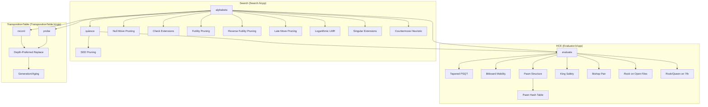

# Design Document — HCE GM-Strength

## Overview

This design raises Blunder's HCE-mode playing strength from ~2212 Elo to 2500+ Elo through four phases of improvements to the search, evaluation, and transposition table subsystems. All changes preserve the coaching protocol's ability to extract interpretable eval breakdowns (material, mobility, king_safety, pawn_structure).

The work is organized by expected Elo/effort ratio:

1. **Phase 1 — Search improvements**: Check extensions, futility pruning, reverse futility pruning, SEE pruning in quiescence, late move pruning, logarithmic LMR, countermove heuristic, singular extensions. These benefit any evaluator and have the highest Elo/effort ratio.
2. **Phase 2 — HCE evaluation improvements**: Pawn structure (passed/isolated/doubled/backward/connected), king safety (pawn shield, open files, attack count), bitboard-based mobility, bishop pair, rook on open files, rook/queen on 7th rank.
3. **Phase 3 — TT improvements**: Depth-preferred replacement with aging, configurable TT size via UCI/Xboard.
4. **Phase 4 — Miscellaneous**: History table aging (already implemented in iterative deepening loop), is_draw optimization (already implemented with half_move_count scan limit and step-by-2).

**Key constraint**: The `EvalBreakdown` struct in `PositionAnalyzer.h` expects `material`, `mobility`, `king_safety`, and `pawn_structure` sub-scores. The HCE must expose these individually so `PositionAnalyzer::compute_eval_breakdown()` can populate them.

## Architecture

The changes touch three subsystems with clear boundaries:



### Design Rationale

- **Search-first approach**: Search improvements (check extensions, pruning, LMR) yield the most Elo per line of code because they let the engine search deeper. A better evaluator only helps if the search can reach the positions where it matters.
- **Bitboard mobility**: The current `MoveGenerator::add_all_moves` approach for mobility is expensive (generates full legal move lists). Using precomputed attack bitboards (knight lookup tables, bishop/rook magic bitboards already in `MoveGenerator`) with `pop_count` is ~10x faster.
- **Pawn hash table**: Pawn structure changes rarely (only on pawn moves/captures). Caching pawn eval in a dedicated hash table keyed by pawn-only Zobrist hash avoids redundant computation at ~95% of nodes.
- **TT depth-preferred replacement**: The current always-replace scheme (`TranspositionTable::record`) overwrites deep entries with shallow ones. Depth-preferred with aging preserves valuable deep entries while still replacing stale ones.

## Components and Interfaces

### 1. Search Extensions and Pruning (Search.h/cpp)

**New member variables in `Search`:**

```cpp
// Countermove table: [side][from_square][to_square]
Move_t countermoves_[2][64][64] = {};

// LMR reduction lookup table: [depth][move_index]
static int lmr_table_[MAX_SEARCH_PLY][64];
static bool lmr_initialized_;

// Singular extension tracking
bool singular_excluded_[MAX_SEARCH_PLY] = {};
```

**Modified methods:**

- `alphabeta()` — Add check extensions, futility pruning, reverse futility pruning, late move pruning, logarithmic LMR reductions, countermove scoring, singular extensions.
- `quiesce()` — Add SEE pruning before `do_move` for captures.
- `search()` — Clear countermove table at start. LMR table initialized once via static init.
- `score_killers()` — Renamed to `score_quiet_moves()`, also scores countermoves at priority 70.

**New static initializer:**

```cpp
static void init_lmr_table();  // Called once, computes floor(log(d)*log(i)/2.0)
```

### 2. HCE Evaluation (Evaluator.h/cpp)

**New struct for pawn hash entries:**

```cpp
struct PawnHashEntry {
    U64 key;
    int mg_score;
    int eg_score;
};
```

**Extended `HandCraftedEvaluator` interface:**

```cpp
class HandCraftedEvaluator : public Evaluator {
public:
    // Existing
    int evaluate(const Board& board) override;
    int side_relative_eval(const Board& board) override;

    // New: sub-score accessors for coaching protocol
    int get_pawn_structure_score() const { return last_pawn_structure_; }
    int get_king_safety_score() const { return last_king_safety_; }
    int get_mobility_score() const { return last_mobility_; }

private:
    // New evaluation components
    int eval_pawn_structure(const Board& board, int phase);
    int eval_king_safety(const Board& board, int phase);
    int eval_mobility(const Board& board, int phase);
    int eval_piece_bonuses(const Board& board, int phase);

    // Pawn hash table
    static constexpr int PAWN_HASH_SIZE = 16384;
    PawnHashEntry pawn_hash_[PAWN_HASH_SIZE] = {};

    // Cached sub-scores from last evaluate() call
    int last_pawn_structure_ = 0;
    int last_king_safety_ = 0;
    int last_mobility_ = 0;
};
```

**Evaluation terms and weights (centipawns):**

| Term | MG | EG | Notes |
|------|----|----|-------|
| Passed pawn (rank 2-7) | 10-70 scaled by rank | 15-120 scaled by rank | Larger bonus closer to promotion |
| Isolated pawn | -10 | -20 | No friendly pawns on adjacent files |
| Doubled pawn | -10 | -10 | Per extra pawn on same file |
| Backward pawn | -8 | -10 | Cannot advance safely, no support behind |
| Connected pawn | 5-15 scaled by rank | 5-10 scaled by rank | Defended by or adjacent to friendly pawn |
| Bishop pair | 30 | 50 | Two or more bishops |
| Rook open file | 20 | 25 | No pawns on file |
| Rook semi-open file | 10 | 15 | No friendly pawns, enemy pawn present |
| Rook/Queen on 7th | 20 | 30 | Enemy king on 8th rank |
| Pawn shield (per missing pawn) | -15 | 0 | Files adjacent to castled king |
| Open file near king | -20 | 0 | Semi-open or open file adjacent to king |
| King zone attacks (per attacker) | -8 | 0 | Enemy pieces attacking king zone squares |
| Mobility (knight/bishop per sq) | 4 | 4 | Pseudo-legal squares minus friendly/pawn-controlled |
| Mobility (rook per sq) | 2 | 3 | |
| Mobility (queen per sq) | 1 | 2 | |

### 3. TranspositionTable (TranspositionTable.h/cpp)

**Modified `HASHE` struct:**

```cpp
struct HASHE {
    U64 key;
    int depth;
    int flags;
    int value;
    Move_t best_move;
    uint8_t generation;  // NEW: search generation for aging
};
```

**Modified `TranspositionTable` class:**

```cpp
class TranspositionTable {
public:
    // Existing interface unchanged
    void clear();
    void resize(int size_mb);
    int probe(U64 hash, int depth, int alpha, int beta, Move_t& best_move);

    // Modified: record now uses depth-preferred + aging replacement
    void record(U64 hash, int depth, int val, int flags, Move_t best_move);

    // New: generation management
    void new_generation() { generation_ = (generation_ + 1) & 0xFF; }
    uint8_t generation() const { return generation_; }

private:
    uint8_t generation_ = 0;  // 8-bit wrapping counter
    // ... existing members
};
```

**Replacement policy in `record()`:**

```
if (existing.key == 0)                          → replace (empty slot)
if (existing.generation != current_generation)  → replace (stale entry)
if (new_depth >= existing.depth)                → replace (deeper or equal)
otherwise                                       → keep existing
```

### 4. Pawn Zobrist Hash (Zobrist.h)

The pawn hash table needs a pawn-only Zobrist key. This is computed by XOR-ing only the pawn piece keys from the existing `Zobrist::pieces_` table. No new random keys are needed — we just selectively XOR the pawn entries during `evaluate()`.

```cpp
// In evaluate(), compute pawn hash on the fly:
U64 pawn_hash = 0;
U64 wp = board.bitboard(WHITE_PAWN);
while (wp) { int sq = bit_scan_forward(wp); pawn_hash ^= Zobrist::get_pieces(WHITE_PAWN, sq); wp &= wp - 1; }
U64 bp = board.bitboard(BLACK_PAWN);
while (bp) { int sq = bit_scan_forward(bp); pawn_hash ^= Zobrist::get_pieces(BLACK_PAWN, sq); bp &= bp - 1; }
```

## Data Models

### Search State Additions

```cpp
// In Search class:
Move_t countermoves_[2][64][64];     // [side][prev_from][prev_to] → refutation move
static int lmr_table_[64][64];       // [depth][move_index] → reduction amount
bool singular_excluded_[MAX_SEARCH_PLY];  // prevent recursive singular extensions
```

### Pawn Hash Entry

```cpp
struct PawnHashEntry {
    U64 key;        // Pawn-only Zobrist hash
    int mg_score;   // Middlegame pawn structure score
    int eg_score;   // Endgame pawn structure score
};
```

### HASHE Entry (Modified)

```cpp
struct HASHE {
    U64 key;              // Full Zobrist hash
    int depth;            // Search depth
    int flags;            // HASH_EXACT, HASH_ALPHA, HASH_BETA
    int value;            // Score
    Move_t best_move;     // Best move found
    uint8_t generation;   // Search generation for aging
};
```

### EvalConfig (Extended)

```cpp
struct EvalConfig {
    bool mobility_enabled = true;
    bool tempo_enabled = true;
    bool pawn_structure_enabled = true;   // NEW
    bool king_safety_enabled = true;      // NEW
    bool piece_bonuses_enabled = true;    // NEW
};
```

### Futility Margins

```cpp
constexpr int FUTILITY_MARGIN[3] = { 0, 200, 500 };  // depth 0, 1, 2
constexpr int RFP_MARGIN_PER_DEPTH = 120;             // reverse futility: depth * 120
```

### Late Move Pruning Thresholds

```cpp
// LMP threshold: 3 + depth * 4
constexpr int lmp_threshold(int depth) { return 3 + depth * 4; }
```

### Singular Extension Parameters

```cpp
constexpr int SE_MIN_DEPTH = 8;
constexpr int SE_MARGIN = 50;  // centipawns below TT value
```


## Correctness Properties

*A property is a characteristic or behavior that should hold true across all valid executions of a system — essentially, a formal statement about what the system should do. Properties serve as the bridge between human-readable specifications and machine-verifiable correctness guarantees.*

### Property 1: Check extension increases search depth

*For any* board position where the side to move is in check, the alphabeta search at depth D should effectively search one ply deeper than it would without check extensions. Concretely: for any position in check, the search with check extensions enabled should visit at least as many nodes as without, and the resulting score should be at least as accurate (no worse in tactical positions).

**Validates: Requirements 1.1, 1.2**

### Property 2: Futility pruning reduces nodes without missing tactics

*For any* board position at depth 1-2 where the static eval plus the futility margin is below alpha, the search with futility pruning should visit fewer or equal nodes than without, and should still find any winning capture or promotion available at that node. The search result should not be worse than the result without futility pruning for positions containing tactical moves (captures, promotions).

**Validates: Requirements 2.1, 2.2, 2.5**

### Property 3: Pruning is disabled when in check

*For any* board position where the side to move is in check, the search result should be identical whether futility pruning, reverse futility pruning, late move pruning, and LMR are enabled or disabled. Check positions must never be pruned or reduced.

**Validates: Requirements 2.3, 3.2, 5.2, 6.4**

### Property 4: Reverse futility pruning returns beta for clearly winning positions

*For any* board position at depth 1-3 where the static eval minus (depth × 120) is greater than or equal to beta, and the side is not in check, and it is not a PV node, the search should return a value >= beta.

**Validates: Requirements 3.1**

### Property 5: SEE pruning in quiescence skips losing captures

*For any* board position, the quiescence search with SEE pruning should visit fewer or equal nodes than without SEE pruning, and the returned score should be greater than or equal to the score without SEE pruning (since only losing captures are skipped, the stand-pat or winning captures determine the score).

**Validates: Requirements 4.1, 4.2**

### Property 6: LMR lookup table matches logarithmic formula

*For any* valid depth in [1, MAX_SEARCH_PLY) and move index in [1, 64), the LMR lookup table value should equal `max(1, floor(log(depth) * log(move_index) / 2.0))`. This is a pure computational invariant.

**Validates: Requirements 6.1**

### Property 7: Countermove table is cleared per search

*For any* sequence of two consecutive searches on different positions, the countermove table should be zeroed at the start of each search. No countermove from a previous search should leak into the next search.

**Validates: Requirements 7.4**

### Property 8: Pawn structure scoring is consistent with pawn features

*For any* board position, the pawn structure sub-score should reflect: (a) a bonus for passed pawns that increases monotonically with rank advancement, (b) a penalty for isolated pawns, (c) a penalty for doubled pawns, (d) a penalty for backward pawns, (e) a bonus for connected pawns. Specifically, adding a passed pawn on a higher rank should increase the pawn structure score more than adding one on a lower rank.

**Validates: Requirements 9.1, 9.2, 9.3, 9.4, 9.5**

### Property 9: Pawn hash table caching is transparent

*For any* board position, evaluating the pawn structure with an empty pawn hash table should produce the same result as evaluating with a pre-populated pawn hash table (cache hit). The pawn hash table must not change the evaluation result — it is purely a performance optimization.

**Validates: Requirements 9.6**

### Property 10: Eval sub-scores sum to total eval

*For any* board position, the sum of the material, mobility, king_safety, and pawn_structure sub-scores (plus tempo) should approximately equal the total HCE evaluation. The sub-scores must be individually accessible and non-trivially populated for positions with the corresponding features.

**Validates: Requirements 9.7, 10.5, 11.6**

### Property 11: King safety scoring reflects shield and attacks

*For any* board position in the middlegame phase (phase > 40/128), the king safety score should: (a) be better with an intact pawn shield than with missing shield pawns, (b) penalize open/semi-open files adjacent to the king, (c) penalize proportionally to the number of enemy piece attacks on the king zone. For endgame positions (phase <= 40/128), king safety should contribute zero.

**Validates: Requirements 10.1, 10.2, 10.3, 10.4**

### Property 12: Mobility uses bitboard attack counts excluding friendly and pawn-controlled squares

*For any* board position, the mobility count for each piece should equal the popcount of its attack bitboard minus squares occupied by friendly pieces and squares controlled by enemy pawns. Knight/bishop mobility should be weighted higher than rook/queen mobility. The mobility score should be tapered between middlegame and endgame weights.

**Validates: Requirements 11.2, 11.3, 11.4**

### Property 13: Bishop pair bonus is applied correctly

*For any* board position where a side has two or more bishops, the evaluation should include a tapered bonus of 30 cp (middlegame) and 50 cp (endgame) compared to the same position with one bishop removed.

**Validates: Requirements 12.1**

### Property 14: Rook file bonuses are applied correctly

*For any* board position with a rook on a file, the evaluation should include: (a) a 20/25 cp tapered bonus if the file has no pawns of either color (open file), (b) a 10/15 cp tapered bonus if the file has no friendly pawns but has enemy pawns (semi-open file), (c) no file bonus if the file has friendly pawns.

**Validates: Requirements 13.1, 13.2**

### Property 15: Rook/Queen on 7th rank bonus

*For any* board position where a rook or queen is on the 7th rank (relative to the opponent) and the enemy king is on the 8th rank, the evaluation should include a 20/30 cp tapered bonus. This applies symmetrically for both colors.

**Validates: Requirements 14.1, 14.2**

### Property 16: TT depth-preferred replacement with aging

*For any* sequence of TT record operations at the same hash index: (a) a new entry replaces an empty slot, (b) a new entry replaces a stale entry (different generation) regardless of depth, (c) a new entry with depth >= existing depth replaces the existing entry, (d) a new entry with depth < existing depth and same generation does NOT replace the existing entry.

**Validates: Requirements 15.1, 15.2, 15.3, 17.3**

### Property 17: TT resize accepts valid sizes

*For any* size N in [1, 4096] megabytes, calling resize(N) should result in a TT with approximately N MB of storage. The TT should default to 64 MB when no size is specified.

**Validates: Requirements 16.1, 16.2, 16.3, 16.4**

### Property 18: TT generation tracking

*For any* sequence of new_generation() calls, the generation counter should increment by 1 each time and wrap at 256 (modular arithmetic). Each record() call should store the current generation in the HASHE entry.

**Validates: Requirements 17.1, 17.2, 17.4**

### Property 19: History table aging halves values

*For any* history table state, applying the aging operation (at the start of each iterative deepening iteration after depth 1) should result in all values being floor(original_value / 2). This prevents overflow from unbounded depth×depth increments.

**Validates: Requirements 18.1**

### Property 20: Repetition detection correctness

*For any* game history, the optimized is_draw function (scanning from max(0, game_ply - half_move_count) with step 2) should produce identical results to a naive full-history scan. Threefold repetition (3 occurrences outside search, 2 during search) must be correctly detected.

**Validates: Requirements 19.1, 19.2, 19.3**

## Error Handling

### Search

- **Depth overflow**: `alphabeta` and `quiesce` check `search_ply > MAX_SEARCH_PLY - 1` and return static eval. Singular extensions and check extensions must not push beyond this limit.
- **Time expiry during singular verification search**: The abort check every 2048 nodes applies inside the verification search. If time expires, the singular extension is skipped (no extension applied).
- **LMR table bounds**: The LMR table is sized `[MAX_SEARCH_PLY][64]`. Depth and move index are clamped before lookup.
- **Countermove table with no previous move**: At root (search_ply == 0), there is no previous move. Countermove lookup is skipped at ply 0.

### Evaluation

- **Empty board**: If no pieces are present, all sub-scores return 0. The phase computation handles this (npm = ENDGAME_LIMIT, phase = 0).
- **Pawn hash collision**: The pawn hash table uses a simple key comparison. On collision (different pawn config, same hash index), the entry is overwritten. This is a performance issue, not a correctness issue — the pawn eval is always recomputable.
- **King not found**: If `bitboard(KING | side)` is 0 (shouldn't happen in legal positions), king safety returns 0.

### Transposition Table

- **Hash collision**: The existing key comparison in `probe()` handles this. A mismatched key returns `UNKNOWN_SCORE`.
- **Resize during search**: `resize()` calls `clear()`, which zeroes all entries. This should only be called between searches (via UCI/Xboard commands).
- **Generation wrap**: The 8-bit counter wraps naturally via `& 0xFF`. After 256 generations, old entries are treated as stale (correct behavior).

## Testing Strategy

### Property-Based Testing

All correctness properties (1-20) will be implemented as property-based tests using [RapidCheck](https://github.com/emil-e/rapidcheck) (C++ property-based testing library, integrates with Catch2).

**Configuration:**
- Minimum 100 iterations per property test
- Each test tagged with: `Feature: hce-gm-strength, Property {N}: {title}`
- Tests placed in `test/source/TestHceGmStrength.cpp`

**Generator strategy:**
- Board positions generated from a set of known FEN strings plus random legal move sequences (play N random legal moves from a starting position)
- Pawn structure tests use boards with specific pawn configurations generated by placing pawns on random squares
- TT tests use random hash values, depths, and scores

### Unit Tests

Unit tests complement property tests for specific examples and edge cases:

- **Check extension**: Known positions where check extension finds a mate that depth-1 misses
- **Futility pruning**: Position where eval + 200 < alpha and a quiet move is correctly pruned
- **SEE pruning**: Position with QxP defended by pawn (SEE < 0) is skipped in quiescence
- **Singular extension**: Known position where TT move is clearly best (e.g., only move to avoid mate)
- **Bishop pair**: Starting position (both bishops) vs position with one bishop traded
- **Rook on 7th**: Known position with rook on 7th rank and enemy king on 8th
- **TT replacement**: Specific sequences testing each replacement case
- **TT default size**: Verify 64 MB default
- **Generation wrap**: 256 increments wraps to 0
- **Pawn structure**: Known positions with isolated, doubled, passed, backward, connected pawns
- **King safety**: Castled king with intact shield vs broken shield

### SPRT Validation

Each phase is validated via SPRT testing (Requirement 20):
- Tool: fast-chess
- Bounds: [-5, 5] Elo, 95% confidence
- Time control: 10+0.1
- Run between phases to confirm Elo gains and catch regressions
