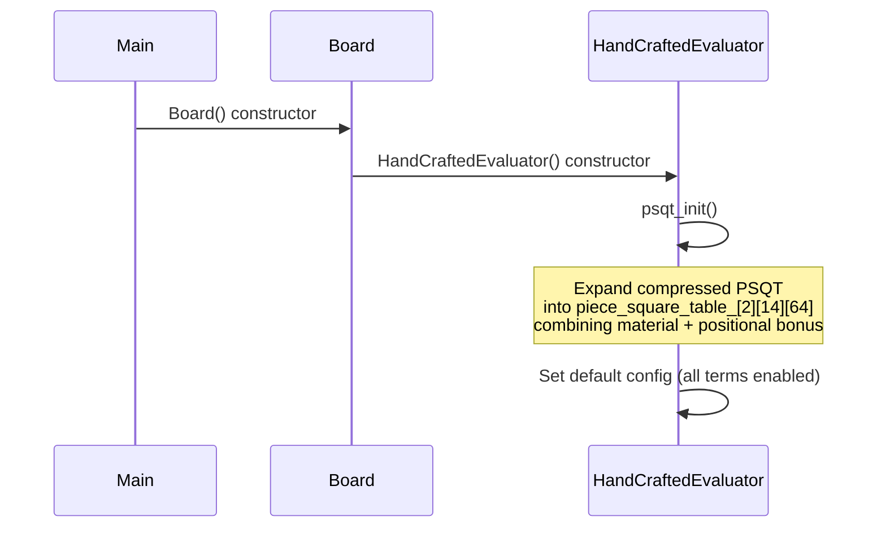

# Design Document: Tapered Evaluation Port

## Overview

This design ports the Stockfish-style tapered evaluation from the `eval` branch into the current Blunder architecture. The core change is replacing the single-phase material + PSQT evaluation in `HandCraftedEvaluator` with a dual-phase (MG/EG) evaluation that blends scores using a game-phase factor derived from non-pawn material.

All changes are confined to `HandCraftedEvaluator` (header and implementation). The `Evaluator` abstract interface, `NNUEEvaluator`, `Board`, `Search`, and all other consumers remain untouched. The evaluator gains:

1. Separate MG/EG material values and piece-square tables (Stockfish-tuned)
2. Compressed file-symmetric PSQT source data expanded at construction time
3. Game phase calculation from non-pawn material (0–128 scale)
4. Tapered score blending: `(mg * phase + eg * (128 - phase)) / 128`
5. Optional mobility term (legal move count difference, coefficient 20)
6. Optional tempo bonus (+28 cp for side to move)
7. Configuration struct with runtime toggles for mobility and tempo, wired to UCI `setoption`

## Architecture

### High-Level Flow

```mermaid
graph TD
    A[Search calls evaluate] --> B[HandCraftedEvaluator::evaluate]
    B --> C[Sum expanded PSQT for all pieces]
    C --> D[Compute game phase from non-pawn material]
    D --> E[Blend: mg*phase + eg*(128-phase) / 128]
    E --> F{Mobility enabled?}
    F -->|Yes| G[Generate legal moves for both sides]
    G --> H[Add 20 * (white_moves - black_moves)]
    F -->|No| I[Skip]
    H --> J{Tempo enabled?}
    I --> J
    J -->|Yes| K[Add ±28 cp for side to move]
    J -->|No| L[Skip]
    K --> M[Return score from white's perspective]
    L --> M
```

### Component Boundaries

The design respects the existing architecture:

- `Evaluator` (abstract base) — unchanged. Defines `evaluate(const Board&)` and `side_relative_eval(const Board&)`.
- `HandCraftedEvaluator` — modified. Gains private data members for expanded PSQT, config struct, and new `psqt_init()` / `phase()` helpers.
- `NNUEEvaluator` — untouched. Continues to override the same interface.
- `Board` — untouched. `get_evaluator()` dispatches to NNUE or HandCrafted as before. Board owns `HandCraftedEvaluator evaluator_` by value, so the new constructor runs automatically.
- `Search` — untouched. Calls `evaluate()` / `side_relative_eval()` through `Evaluator&`.
- `UCI` — minor addition: `cmd_setoption` gains two new option names (`Mobility`, `Tempo`) that forward to the evaluator config. `cmd_uci` advertises them.
- `Xboard` — analogous wiring if the Xboard protocol supports feature options (lower priority).

### Initialization Sequence



## Components and Interfaces

### EvalConfig Struct

A plain struct controlling which optional eval terms are active. Stored as a member of `HandCraftedEvaluator`.

```cpp
struct EvalConfig
{
    bool mobility_enabled = true;
    bool tempo_enabled = true;
};
```

### HandCraftedEvaluator (Modified)

```cpp
class HandCraftedEvaluator : public Evaluator
{
public:
    HandCraftedEvaluator();  // calls psqt_init()

    int evaluate(const Board& board) override;
    int side_relative_eval(const Board& board) override;

    // Runtime configuration
    void set_config(const EvalConfig& cfg) { config_ = cfg; }
    const EvalConfig& config() const { return config_; }

private:
    void psqt_init();
    int phase(const Board& board) const;

    // Expanded table: piece_square_table_[phase][piece][square]
    // phase: 0=MG, 1=EG
    // piece: indexed by piece constant (0..13, only even indices for white, odd for black)
    // square: 0..63
    int piece_square_table_[2][NUM_PIECES][NUM_SQUARES];

    EvalConfig config_;
};
```

### Static Data (in Evaluator.cpp)

Source data arrays defined as file-scope constants:

```cpp
// Phased material values: PIECE_VALUE_BONUS[phase][piece_type]
// piece_type: 0=unused, 1=Pawn, 2=Knight, 3=Bishop, 4=Rook, 5=Queen, 6=King
static constexpr int NUM_PHASES = 2;
static constexpr int MG = 0;
static constexpr int EG = 1;

static const int PIECE_VALUE_BONUS[NUM_PHASES][NUM_PIECES / 2] = {
    // MG: empty, pawn, knight, bishop, rook, queen, king
    { 0, 124, 781, 825, 1276, 2538, 0 },
    // EG
    { 0, 206, 854, 915, 1380, 2682, 0 }
};

// Pawn PSQT: full 64-square layout per phase (pawns are not file-symmetric in Stockfish tuning)
static const int PIECE_SQUARE_BONUS_PAWN[NUM_PHASES][NUM_SQUARES] = { ... };

// Other pieces: compressed 4-column file-symmetric format
// PIECE_SQUARE_BONUS[phase][piece_index][rank][file_half]
// piece_index: 0=Knight, 1=Bishop, 2=Rook, 3=Queen, 4=King
static const int PIECE_SQUARE_BONUS[NUM_PHASES][5][8][4] = { ... };
```

### Phase Constants

```cpp
static constexpr int MIDGAME_LIMIT = 15258;
static constexpr int ENDGAME_LIMIT = 3915;
static constexpr int PHASE_MAX = 128;
```

### UCI Integration

Two new UCI options:

| Option Name | Type  | Default | Description                    |
|-------------|-------|---------|--------------------------------|
| Mobility    | check | true    | Enable/disable mobility term   |
| Tempo       | check | true    | Enable/disable tempo bonus     |

`cmd_uci()` advertises them. `cmd_setoption()` routes them to `board_.get_evaluator()` after a dynamic_cast or by storing a pointer to the `HandCraftedEvaluator` directly. Since `Board` owns `HandCraftedEvaluator evaluator_` by value, UCI can access it through a new `Board::get_hce()` accessor that returns `HandCraftedEvaluator&`.

### Mobility Computation

Uses `MoveGenerator::add_all_moves()` to generate legal moves for each side, then counts them via `MoveList::length()`. This is the same infrastructure already used by Search.

```cpp
// Inside evaluate():
if (config_.mobility_enabled)
{
    MoveList white_moves, black_moves;
    MoveGenerator::add_all_moves(white_moves, board, WHITE);
    MoveGenerator::add_all_moves(black_moves, board, BLACK);
    score += 20 * (white_moves.length() - black_moves.length());
}
```

## Data Models

### Expanded PSQT Layout

The core data structure is a 3D array:

```
piece_square_table_[phase][piece][square]
```

- `phase`: 0 = MG, 1 = EG (2 entries)
- `piece`: Uses the engine's piece constants directly (WHITE_PAWN=2, BLACK_PAWN=3, ..., BLACK_KING=13). Indices 0 and 1 are unused. (14 entries, 12 used)
- `square`: 0–63, standard a1=0 layout (64 entries)

Each entry stores the combined material value + positional bonus for that (phase, piece, square) triple. This means evaluation is a single loop over occupied squares with one table lookup per piece.

### PSQT Expansion Logic (psqt_init)

```
For each phase in {MG, EG}:
  For each piece_type in {Pawn, Knight, Bishop, Rook, Queen, King}:
    For each square 0..63:
      rank = square / 8
      file = square % 8

      // Get positional bonus
      if piece_type == Pawn:
        bonus = PIECE_SQUARE_BONUS_PAWN[phase][rank * 8 + file]
      else:
        file_half = min(file, 7 - file)  // file symmetry: 0,1,2,3,3,2,1,0
        piece_index = piece_type_to_index(piece_type)  // Knight=0, Bishop=1, Rook=2, Queen=3, King=4
        bonus = PIECE_SQUARE_BONUS[phase][piece_index][rank][file_half]

      // White piece: table is from white's perspective (rank 0 = rank 8 on board)
      // The source tables are stored with rank 0 at the top (rank 8), so for white
      // we flip: white_square = square ^ 56
      piece_square_table_[phase][white_piece][square] = PIECE_VALUE_BONUS[phase][piece_type] + bonus_at_flipped_rank

      // Black piece: no flip needed (black's rank 8 = index rank 0)
      piece_square_table_[phase][black_piece][square] = PIECE_VALUE_BONUS[phase][piece_type] + bonus
```

The key insight: source PSQT data is written from white's perspective with rank 8 at array index 0. For white pieces, we flip the square vertically (`sq ^ 56`) when reading from the source table. For black pieces, we read directly (since black's "good" squares are the mirror of white's).

### Game Phase Calculation

```
npm = sum of MG material values for all non-pawn, non-king pieces (both sides)
     = count(white_knights) * 781 + count(black_knights) * 781
     + count(white_bishops) * 825 + count(black_bishops) * 825
     + count(white_rooks) * 1276 + count(black_rooks) * 1276
     + count(white_queens) * 2538 + count(black_queens) * 2538

if npm >= MIDGAME_LIMIT: phase = 128
else if npm <= ENDGAME_LIMIT: phase = 0
else: phase = 128 * (npm - ENDGAME_LIMIT) / (MIDGAME_LIMIT - ENDGAME_LIMIT)
```

### Evaluation Formula

```
mg_score = 0, eg_score = 0
for each square with a piece:
    if piece is white:
        mg_score += piece_square_table_[MG][piece][square]
        eg_score += piece_square_table_[EG][piece][square]
    else (black):
        mg_score -= piece_square_table_[MG][piece][square]
        eg_score -= piece_square_table_[EG][piece][square]

phase = compute_phase(board)
score = (mg_score * phase + eg_score * (128 - phase)) / 128

if mobility_enabled:
    score += 20 * (white_legal_moves - black_legal_moves)

if tempo_enabled:
    score += (side_to_move == WHITE) ? +28 : -28

return score  // from white's perspective
```


## Correctness Properties

*A property is a characteristic or behavior that should hold true across all valid executions of a system — essentially, a formal statement about what the system should do. Properties serve as the bridge between human-readable specifications and machine-verifiable correctness guarantees.*

### Property 1: File symmetry in expanded PSQT

*For any* non-pawn piece type, any game phase (MG or EG), and any rank, the expanded PSQT value for a white piece on file X should equal the value on the mirrored file (A↔H, B↔G, C↔F, D↔E). Formally: `piece_square_table_[phase][piece][rank*8 + file] == piece_square_table_[phase][piece][rank*8 + (7 - file)]` for all non-pawn piece types.

**Validates: Requirements 2.4**

### Property 2: Black/white vertical flip in expanded PSQT

*For any* piece type, any game phase, and any square, the expanded PSQT value for the black piece at square S should equal the value for the corresponding white piece at the vertically flipped square (S ^ 56). Formally: `piece_square_table_[phase][black_piece][sq] == piece_square_table_[phase][white_piece][sq ^ 56]`.

**Validates: Requirements 2.5**

### Property 3: Game phase clamping and formula

*For any* board position, the computed game phase should be in [0, 128]. When total non-pawn material (npm) is at or above 15258, phase should be 128. When npm is at or below 3915, phase should be 0. For npm values between the limits, phase should equal `128 * (npm - 3915) / (15258 - 3915)`.

**Validates: Requirements 3.2, 3.3, 3.4, 3.5**

### Property 4: Evaluation color symmetry

*For any* legal chess position, evaluating the position and evaluating its color-mirrored counterpart (swap all white/black pieces, flip ranks, swap side to move, mirror castling rights and EP square) should produce negated scores: `evaluate(pos) == -evaluate(mirror(pos))`. This must hold with mobility and tempo both disabled (since mobility depends on move generation which may not be perfectly symmetric in all edge cases, and tempo explicitly breaks symmetry by design).

**Validates: Requirements 4.1, 4.3**

### Property 5: Tapered blending at phase extremes

*For any* position that is fully middlegame (phase = 128, i.e., starting position or positions with npm ≥ 15258), the tapered eval (with mobility and tempo disabled) should equal the pure MG score. *For any* position that is fully endgame (phase = 0, i.e., only pawns and kings remain), the tapered eval should equal the pure EG score.

**Validates: Requirements 4.2**

### Property 6: Mobility contribution

*For any* legal chess position, the difference between `evaluate()` with mobility enabled vs. disabled (tempo disabled in both) should equal `20 * (white_legal_moves - black_legal_moves)`, where legal move counts are computed independently via `MoveGenerator::add_all_moves()`.

**Validates: Requirements 5.2**

### Property 7: Tempo contribution

*For any* legal chess position, the difference between `evaluate()` with tempo enabled vs. disabled (mobility disabled in both) should equal +28 if white is the side to move, or -28 if black is the side to move.

**Validates: Requirements 6.1**

### Property 8: Expanded PSQT contains material plus positional bonus

*For any* valid piece type with nonzero material value (Pawn through Queen) and any game phase, the expanded PSQT value for a white piece on any square should be at least the material value for that piece type and phase (since positional bonuses can be negative, the minimum is material + min_bonus, but the value should never be zero for a piece with material).

**Validates: Requirements 7.3, 2.6**

### Property 9: side_relative_eval semantics

*For any* legal chess position, `side_relative_eval(board)` should equal `evaluate(board)` when white is the side to move, and `-evaluate(board)` when black is the side to move.

**Validates: Requirements 10.2**

## Error Handling

The tapered evaluation is a pure computation with no I/O or allocation failures. Error handling is minimal:

- **Invalid piece constants**: The expanded PSQT is indexed by piece constant (0–13). Indices 0 and 1 (EMPTY) are unused and initialized to 0. The evaluation loop skips empty squares, so no out-of-bounds access occurs.
- **Phase division**: The phase formula divides by `(MIDGAME_LIMIT - ENDGAME_LIMIT)` which is a compile-time constant (11343), never zero.
- **Mobility with illegal positions**: If `add_all_moves()` is called on a position with no king, behavior is undefined (same as current engine behavior). The evaluator assumes legal positions.
- **UCI setoption with invalid values**: The `cmd_setoption` handler already silently ignores unknown option names. For the new `Mobility` and `Tempo` options, non-"true"/"false" values are ignored.
- **Config toggle race conditions**: UCI `setoption` is only processed between searches (UCI protocol guarantees this), so no synchronization is needed for `EvalConfig`.

## Testing Strategy

### Dual Testing Approach

Testing uses both unit tests (specific examples, edge cases) and property-based tests (universal properties across generated inputs). The project already uses Catch2 v3.4.0 with `GENERATE` and `SECTION` support. For property-based testing, we use Catch2's `GENERATE` with custom random generators to produce test inputs, running each property test for a minimum of 100 iterations.

### Property-Based Tests

Each correctness property maps to a single property-based test. Tests are tagged with the feature name and property number.

| Test | Property | Tag | Approach |
|------|----------|-----|----------|
| `psqt_file_symmetry` | Property 1 | `Feature: tapered-eval-port, Property 1: File symmetry` | Generate random (phase, non-pawn piece, rank) triples, verify file A==H, B==G, C==F, D==E |
| `psqt_color_flip` | Property 2 | `Feature: tapered-eval-port, Property 2: Color flip` | Generate random (phase, piece_type, square) triples, verify black[sq] == white[sq^56] |
| `phase_clamping_and_formula` | Property 3 | `Feature: tapered-eval-port, Property 3: Phase formula` | Generate random piece configurations (varying non-pawn material), verify phase is in [0,128] and matches formula |
| `eval_color_symmetry` | Property 4 | `Feature: tapered-eval-port, Property 4: Color symmetry` | Use a set of diverse FEN positions, mirror each, verify evaluate(pos) == -evaluate(mirror(pos)) with mobility/tempo off |
| `tapered_blending_extremes` | Property 5 | `Feature: tapered-eval-port, Property 5: Blending extremes` | Generate positions at phase boundaries (full MG, full EG), verify score equals pure MG or EG score |
| `mobility_contribution` | Property 6 | `Feature: tapered-eval-port, Property 6: Mobility contribution` | For diverse positions, compute eval with/without mobility, verify difference equals 20*(white_moves - black_moves) |
| `tempo_contribution` | Property 7 | `Feature: tapered-eval-port, Property 7: Tempo contribution` | For diverse positions, compute eval with/without tempo, verify difference is ±28 based on side to move |
| `psqt_material_included` | Property 8 | `Feature: tapered-eval-port, Property 8: Material in PSQT` | For all (phase, piece_type, square) with nonzero material, verify table value is nonzero |
| `side_relative_eval_semantics` | Property 9 | `Feature: tapered-eval-port, Property 9: side_relative_eval` | For diverse positions, verify side_relative_eval == ±evaluate based on side to move |

### Unit Tests (Examples and Edge Cases)

- Verify exact Stockfish material values (Req 1.2): spot-check PIECE_VALUE_BONUS entries
- Verify default config has all terms enabled (Req 8.6)
- Verify phase = 128 for starting position (Req 3.4 edge case)
- Verify phase = 0 for K vs K position (Req 3.3 edge case)
- Verify known eval for starting position matches expected value
- Verify `Board::get_evaluator()` dispatches correctly (Req 10.4)

### Test Configuration

- Property-based tests: minimum 100 iterations each using Catch2 `GENERATE` with random seeds
- Each property test references its design document property via tag comment
- Tag format: `Feature: tapered-eval-port, Property {N}: {title}`
- Tests go in `test/source/TestTaperedEval.cpp`, added to `test/CMakeLists.txt`
- Property-based testing library: Catch2 v3.4.0 (already in use) with `GENERATE(take(100, random(...)))` for randomized inputs
- Each correctness property is implemented by a single property-based test
