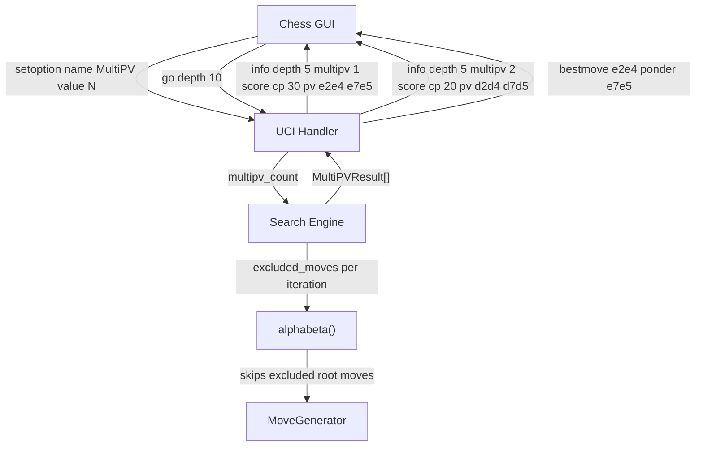

# Design Document: UCI MultiPV Support

## Overview

This design adds MultiPV (multiple principal variations) support to the blunder chess engine. MultiPV allows the engine to report the top N best lines during analysis, which is a standard UCI feature used by chess GUIs for position analysis.

The implementation follows the standard approach used by engines like Stockfish: at each iterative deepening depth, perform N separate alpha-beta searches, each time excluding the root moves already chosen as better PV lines. The results are ranked by score and reported as numbered `info` lines with the `multipv` field.

Key design decisions:
- MultiPV logic lives in `Search::search()` (iterative deepening loop), not in `alphabeta()` itself
- Root move exclusion is passed as a vector of moves to skip, checked only at the root node (ply 0)
- PV results are collected into a new `MultiPVResult` struct that holds score + PV line per variation
- The UCI handler stores the MultiPV count and passes it to the search; info line formatting is handled in the search's UCI output mode
- MCTS path is completely unaffected; the MultiPV count is ignored when `use_mcts_` is true

## Architecture

The feature touches three layers:



### Control Flow for MultiPV Search

At each iterative deepening depth `d`:

1. Clear the `excluded_moves` set
2. For `pv_index` = 0 to `min(multipv_count, num_legal_moves) - 1`:
   a. Run `alphabeta(alpha, beta, d, IS_PV, DO_NULL)` with `excluded_moves` active
   b. Store the resulting score and PV line in `results[pv_index]`
   c. Add the root move (PV[0]) to `excluded_moves`
   d. Check time limit; if exceeded, stop and use last fully completed depth
3. Sort `results` by score descending
4. Output `info` lines with `multipv` field (1-indexed)

When `multipv_count == 1`, the loop runs exactly once with an empty exclusion set, producing identical behavior to the current code with no overhead.

## Components and Interfaces

### New Types

```cpp
/// Holds one PV line result: the score and the sequence of moves.
struct PVLine {
    int score = -MAX_SCORE;
    std::vector<Move_t> moves;  // PV move sequence

    Move_t best_move() const { return moves.empty() ? 0U : moves[0]; }
    Move_t ponder_move() const { return moves.size() >= 2 ? moves[1] : 0U; }
};
```

### Modified: `Search` class

```cpp
class Search {
public:
    // Existing search entry point gains multipv parameter
    Move_t search(int depth,
                  int search_time = DEFAULT_SEARCH_TIME,
                  int max_nodes_visited = -1,
                  bool xboard = false,
                  int multipv_count = 1);

    // Access the MultiPV results from the last search
    const std::vector<PVLine>& get_multipv_results() const { return multipv_results_; }

private:
    // Root move exclusion set, checked at ply 0 in alphabeta
    std::vector<Move_t> excluded_root_moves_;

    // Results for all PV lines at the last completed depth
    std::vector<PVLine> multipv_results_;

    // Helper: extract PV moves from the PV table into a vector
    std::vector<Move_t> extract_pv_moves() const;
};
```

### Modified: `alphabeta()` — Root Move Exclusion

At the top of the move loop in `alphabeta()`, when `search_ply == 0`, skip any move that appears in `excluded_root_moves_`. This is the only change to the core search algorithm.

```cpp
// Inside alphabeta move loop, after sort_moves:
if (search_ply == 0 && !excluded_root_moves_.empty()) {
    bool excluded = false;
    for (Move_t ex : excluded_root_moves_) {
        if (move == ex) { excluded = true; break; }
    }
    if (excluded) continue;
}
```

### Modified: `UCI` class

```cpp
class UCI {
private:
    int multipv_count_ = 1;  // Default: single PV (standard behavior)
};
```

Changes:
- `cmd_uci()`: Add `option name MultiPV type spin default 1 min 1 max 256` line
- `cmd_setoption()`: Handle `MultiPV` option name, clamp value to [1, 256]
- `start_search()`: Pass `multipv_count_` to `search_.search()`
- `start_search()`: When `use_mcts_` is true, ignore `multipv_count_` (always single PV)
- `start_search()`: After search completes, extract bestmove/ponder from `multipv_results_[0]`

### Modified: Info Line Output

The info line output in `Search::search()` is modified to:
- When `multipv_count > 1`: include `multipv <index>` field (1-indexed) in each info line
- When `multipv_count == 1`: omit `multipv` field (backward compatible)
- Output one info line per PV line per completed depth

### Unchanged Components

- `alphabeta()` internal logic (aside from root exclusion check)
- `quiesce()` — no changes
- `PrincipalVariation` class — still used internally per-search; results are extracted into `PVLine` structs
- `TimeManager` — existing `should_stop()` and `is_time_over()` are sufficient
- `Book` — book lookup happens before search, no MultiPV interaction needed
- `MCTS` — completely unaffected
- `MoveGenerator`, `Board`, `Evaluator` — no changes

## Data Models

### PVLine

| Field | Type | Description |
|-------|------|-------------|
| `score` | `int` | Evaluation score in centipawns |
| `moves` | `std::vector<Move_t>` | Ordered sequence of PV moves |

### MultiPV State in Search

| Field | Type | Description |
|-------|------|-------------|
| `excluded_root_moves_` | `std::vector<Move_t>` | Root moves to skip in current PV iteration |
| `multipv_results_` | `std::vector<PVLine>` | Results from last fully completed depth |

### MultiPV State in UCI

| Field | Type | Default | Description |
|-------|------|---------|-------------|
| `multipv_count_` | `int` | 1 | Number of PVs to search, set via `setoption` |


## Correctness Properties

*A property is a characteristic or behavior that should hold true across all valid executions of a system — essentially, a formal statement about what the system should do. Properties serve as the bridge between human-readable specifications and machine-verifiable correctness guarantees.*

### Property 1: MultiPV count clamping

*For any* integer N, after sending `setoption name MultiPV value N`, the stored MultiPV count should equal `clamp(N, 1, 256)`.

**Validates: Requirements 2.1, 2.2**

### Property 2: Distinct root moves in MultiPV results

*For any* chess position with at least 2 legal moves and any `multipv_count > 1`, all PV lines returned by the search should have distinct root moves (first moves).

**Validates: Requirements 3.1**

### Property 3: MultiPV=1 backward compatibility

*For any* chess position, searching with `multipv_count = 1` should produce the same best move and score as the existing single-PV search.

**Validates: Requirements 3.2**

### Property 4: PV lines sorted by descending score

*For any* chess position and any `multipv_count`, the PV lines in the search results should be ordered by non-increasing evaluation score (best first).

**Validates: Requirements 3.3**

### Property 5: PV count capped by legal moves

*For any* chess position with L legal moves and any `multipv_count = N`, the number of PV lines returned should equal `min(N, L)`.

**Validates: Requirements 3.4**

### Property 6: Multipv field conditional presence

*For any* search, the `multipv` field should be present in info lines if and only if `multipv_count > 1`. When present, values should range from 1 to the number of PV lines.

**Validates: Requirements 4.1, 4.3**

### Property 7: Info line field completeness

*For any* MultiPV search result, each info line should contain the fields: depth, score cp, nodes, nps, time, and the PV move sequence. When `multipv_count > 1`, the multipv index field should also be present.

**Validates: Requirements 4.2**

### Property 8: Bestmove and ponder from top PV

*For any* chess position and any `multipv_count`, the `bestmove` should equal the first move of the highest-ranked PV line, and the `ponder` move (if present) should equal the second move of that PV line.

**Validates: Requirements 5.1, 5.2**

### Property 9: MCTS ignores MultiPV

*For any* chess position in MCTS search mode, regardless of the `multipv_count` setting, the search should return a single best move (no multiple PV lines).

**Validates: Requirements 8.1**

## Error Handling

| Scenario | Handling |
|----------|----------|
| `setoption name MultiPV value <non-integer>` | Ignore the command (existing `cmd_setoption` behavior for parse failures) |
| `setoption name MultiPV value N` where N < 1 | Clamp to 1 |
| `setoption name MultiPV value N` where N > 256 | Clamp to 256 |
| MultiPV count exceeds legal moves | Report only as many PV lines as there are legal moves |
| Time expires during a PV iteration | Stop current depth, use results from last fully completed depth |
| Search aborted (stop command) during MultiPV | Use results from last fully completed depth, or fallback to first legal move |
| All root moves excluded (shouldn't happen) | The inner loop naturally terminates when `pv_index` reaches `min(multipv_count, num_legal_moves)` |
| Book move available with MultiPV enabled | Return book move immediately, skip MultiPV search entirely |

## Testing Strategy

### Test Framework

- Catch2 v3.4.0 (already used by the project)
- Property-based tests use Catch2's `GENERATE` with random seeds to produce varied inputs
- Each property test runs a minimum of 100 iterations across different positions and parameter values

### Unit Tests (Examples and Edge Cases)

1. **UCI handshake advertises MultiPV option** — Send "uci", verify output contains `option name MultiPV type spin default 1 min 1 max 256` before `uciok` (Req 1.1)
2. **Default MultiPV count is 1** — Verify `multipv_count_` is 1 before any setoption (Req 2.3)
3. **Book move takes precedence** — Set up a known book position with MultiPV > 1, verify book move is returned without search (Req 6.1)
4. **Time limit stops MultiPV mid-depth** — Use a very short time limit with high MultiPV count, verify search terminates gracefully (Req 7.1, 7.2)
5. **Checkmate position with MultiPV** — Position with only one legal move, verify single PV line returned regardless of MultiPV count
6. **Stalemate position** — Verify graceful handling when no legal moves exist

### Property-Based Tests

Each property test references its design document property and runs across multiple FEN positions with varied MultiPV counts.

- **Feature: uci-multipv, Property 1: MultiPV count clamping** — Generate random integers, verify clamping to [1, 256]
- **Feature: uci-multipv, Property 2: Distinct root moves** — For each test position and multipv_count in {2, 3, 4}, verify all root moves are unique
- **Feature: uci-multipv, Property 3: MultiPV=1 backward compatibility** — For each test position, compare multipv=1 results with single-PV search results
- **Feature: uci-multipv, Property 4: PV lines sorted by descending score** — For each test position and multipv_count, verify scores are non-increasing
- **Feature: uci-multipv, Property 5: PV count capped by legal moves** — For positions with varying numbers of legal moves, verify result count = min(N, L)
- **Feature: uci-multipv, Property 6: Multipv field conditional presence** — Capture info output, verify multipv field presence matches multipv_count > 1
- **Feature: uci-multipv, Property 7: Info line field completeness** — Capture info output, verify all required fields are present
- **Feature: uci-multipv, Property 8: Bestmove and ponder from top PV** — For each test position, verify bestmove/ponder match top PV line
- **Feature: uci-multipv, Property 9: MCTS ignores MultiPV** — For each test position in MCTS mode, verify single result regardless of multipv_count

### Property-Based Testing Configuration

- Library: Catch2 `GENERATE` with `GENERATE(take(100, random(...)))` for numeric parameters, and a curated set of diverse FEN positions for board state
- Minimum 100 iterations per property test for numeric parameters
- Each test tagged with: `Feature: uci-multipv, Property N: <property_text>`
- Each correctness property is implemented by a single property-based test
- Tests are added to `test/source/TestMultiPV.cpp` and registered in `test/CMakeLists.txt`
